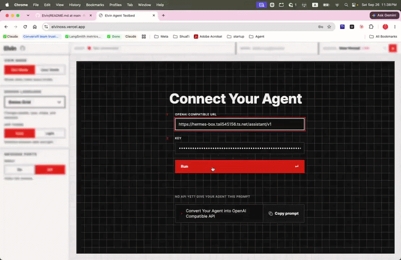

## 1. Demo



**[Static Page: fwanggg.github.io/Elvin](https://fwanggg.github.io/Elvin/)**

## 2. What Is Elvin

A lightweight 1-click frontend for an agent backend (OpenAI-compatible APIs for now): a polished chat UI for testing, plus duration and token measurement.

```bash
git clone https://github.com/fwanggg/Elvin.git && cd Elvin
npm install && npm run dev     # localhost:3000, Node 20.9+
```

Paste an endpoint and key, press **Run**. The key stays in the browser session; nothing is stored server-side.

## 3. Why Elvin

If you are a visual person and want to test your agent backend, this is for you.

It has not been easy for me to test an agent backend visually. Some frameworks (like Hermes) ship a chat dashboard that dumps too much information; LangGraph ships a chat UI ([docs](https://docs.langchain.com/oss/python/langchain/ui)) but it is quite unpolished and missing information. None has the agent trace view and spans that let me repro and find early bugs before heavier tools.

- When your agent harness's default chat UI is broken and emitting noisy data all over you.
- I want to get a feeling of my agent visually, to feel motivated 🙂

## 4. Features

- Give your agent a chat UI in 1 click (needs a prompt to convert your agent to an OpenAI-compatible API first).
- Performance monitoring (runs, turns, spans, token usage) side-by-side with visual highlighting.
- Session management — lightweight, stored in your browser's localStorage.
- Different polished visual styles — for debugging, or to get a feel of what a user likely sees.

## 5. Build and Host It

Elvin is one page and every byte of it runs in your browser, so there is nothing to run on a server: the build is a folder of static files, and any file server can hand them out.

```bash
npm run build      # writes out/
npm run preview    # serves out/ at localhost:4000, via python3
```

`out/` is the whole site — `index.html` with the page already rendered into it, plus hashed JavaScript and CSS. `npm run preview` is nothing more than `python3 -m http.server 4000 --directory out`, which is the whole of hosting it locally. Opening `out/index.html` straight from disk will not work, though: the export references `/_next/...` from the root, which a `file://` page reads as the root of the filesystem. Serve the folder.

**Served from a subpath?** A GitHub Pages project site lives at `/<repo>`, so that build needs the prefix:

```bash
PAGES_BASE_PATH=/Elvin npm run build    # assets emitted as /Elvin/_next/...
python3 -m http.server 4000             # serve the parent of a folder named Elvin
```

**GitHub Pages** does this in [`.github/workflows/pages.yml`](.github/workflows/pages.yml): build, upload `out/`, deploy — on every push to `main`. The workflow holds no secrets and needs none, which is the same reason your agent key stays yours: you type the endpoint into the page, and the key lives in that browser session.

What a static host costs you: an agent on your own machine needs the browser's Local Network Access prompt allowed once when the page is public, and there is no server to keep a secret in.

## 6. Q&A

**My agent is not OpenAI compatible. What should I do?**

Add a gateway that makes it OpenAI compatible — try the prompt shipped in the tool; standing one up is 2–3 minutes of work for a coding agent. Many modern frameworks, like Hermes/OpenClaw, ship one by default.

**What's the CORS error?**

Elvin talks to your agent from inside the browser; all traffic stays on your browser. Your agent backend blocking CORS is what makes the connection fail.

- In general, ask your coding agent to "Make My Agent CORS Permissive".
- **For Hermes:** `hermes -p <profile> config set API_SERVER_CORS_ORIGINS '*'`

**Does it work with an agent backend that runs on localhost?**

O yes, it does. Just use `http://localhost:xxxx/<endpoint>`. Served from the public copy, the browser asks for Local Network Access the first time — the page is public and the agent is on your machine; a local copy has nothing to allow.

## 7. Contributions & License

Issues and pull requests are welcome. MIT — see [LICENSE](LICENSE). © 2026 Fan W.

## 8. Contact Me & Discussion

**[Twitter](https://x.com/WFan14005097)**

**[Subtrack](https://substack.com/@fanwang3)**

**[LinkedIn](https://www.linkedin.com/in/fan-wang-73061a39/)**
