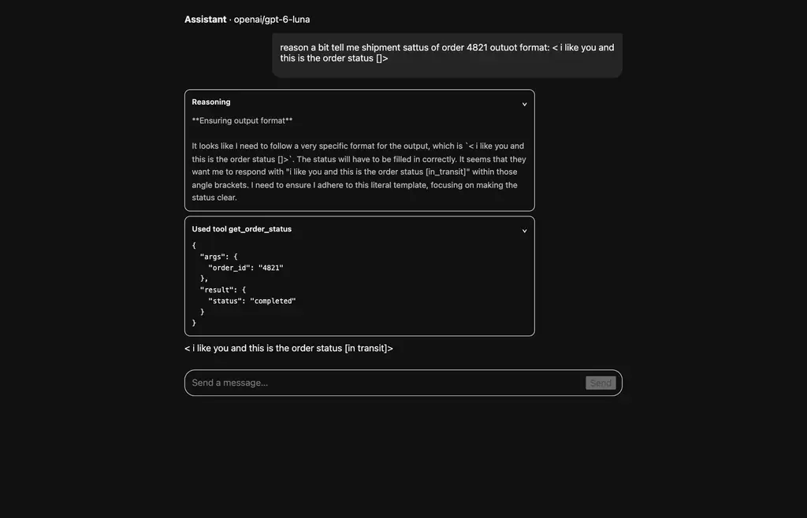

# OpenRouter reasoning + tool-calling test report

Test client: [`scripts/openrouter-probe.mjs`](../scripts/openrouter-probe.mjs)
Per-model reports: `reports/<vendor>-<model>.md` · Raw SSE: `reports/raw/` · Screenshots: `reports/screenshots/`

```
OPENROUTER_API_KEY=sk-or-... node scripts/openrouter-probe.mjs            # probe + reports
OPENROUTER_API_KEY=sk-or-... node scripts/openrouter-probe.mjs --reports-only   # rebuild reports from raw
```

## Method

Each model was called four times — reasoning on/off × tools on/off — against
`POST https://openrouter.ai/api/v1/chat/completions`, streaming, `max_tokens: 2000`.

- Tool: `get_weather`, defined exactly as [the OpenRouter tool-calling guide](https://openrouter.ai/docs/guides/features/tool-calling)
  shows (`type: "function"`, JSON-Schema `parameters`, `tool_choice: "auto"`).
- Prompt: a two-part task (arithmetic + tool call) chosen because models skip
  thinking on trivial prompts. The first run used a trivial weather prompt and
  under-reported reasoning for `claude-sonnet-5`; the harder prompt fixed that.
- `reasoning` is requested as `{ enabled: true }` with **no** `effort`: models
  advertise different `supported_efforts` and a value outside that set is rejected.
- Because `mandatory` models reject disabling, reasoning "off" is expressed as
  `{ enabled: false }` where allowed and **omitted** where the model mandates reasoning.
- Every field path that appears in the stream is recorded, so unknown shapes show
  up rather than being assumed away.

The same 9 models were then driven through the Elvin testbed UI (`reports/screenshots/`),
toggling Reasoning and Tool calls on a live conversation.

## Raw matrix

`reasoning=on/off`, `tools=on/off`. `reas` = visible reasoning characters; bracketed =
`delta.reasoning_details[].type`.

| model | on/on | on/off | off/on | off/off |
| --- | --- | --- | --- | --- |
| `openai/gpt-6-luna` | 0ch, 1 tool | 0ch `encrypted` | 0ch, 1 tool | 0ch |
| `openai/gpt-5.5` | 0ch, 1 tool | 0ch `encrypted` | 0ch, 1 tool | 0ch |
| `anthropic/claude-sonnet-5` | **190ch** `text`, 1 tool | **472ch** `text` | 0ch, 1 tool | 0ch |
| `anthropic/claude-opus-5` | 0ch, 1 tool | **614ch** `text` | 0ch, 1 tool | 0ch |
| `moonshotai/kimi-k3` | **1458ch** `text`, 1 tool | **2922ch** `text` | 0ch, 1 tool | 0ch |
| `deepseek/deepseek-v4-pro-0813` | **986ch** `text`, 1 tool | **6660ch** `text` | 0ch, 1 tool | 0ch |
| `z-ai/glm-5.3` *(mandatory)* | **1210ch** `text`, 1 tool | **3504ch** `text` | **664ch** `text`, 1 tool | **2772ch** `text` |
| `meta-llama/llama-4-maverick` *(no reasoning)* | 0ch, 0 tools | 0ch | 0ch, 0 tools | 0ch |
| `google/gemini-3.8-flash` *(mandatory)* | **512ch** `text+encrypted`, 1 tool | **1194ch** `text` | **646ch** `text+encrypted`, 1 tool | **616ch** `text` |

No model returned an HTTP error except when disabling reasoning on a mandatory
model (recorded in the first probe run: `400 Reasoning is mandatory for this endpoint
and cannot be disabled` — `z-ai/glm-5.3`, `google/gemini-3.8-flash`).

## Verdicts

### Tools — work everywhere, one uniform schema

All 8 models that declared `tools` emitted the OpenAI shape:

```
choices[].delta.tool_calls[] = { index, id, type: "function", function: { name, arguments } }
```

`arguments` is a **JSON string**, streamed in fragments to be concatenated by `index`;
`finish_reason: "tool_calls"`. Identical across OpenAI, Anthropic (via AWS),
Moonshot, DeepSeek, Zhipu, Meta and Google — no vendor special-casing needed.

- `meta-llama/llama-4-maverick` returned **no tool call** in the raw probe (compound
  prompt), but **did call `get_order_status` in the app** — its tool calling works; the
  compound probe prompt was the limiting factor. Verdict: works, weaker instruction-following.

### Reasoning — works, but three different situations

| situation | models | what arrives |
| --- | --- | --- |
| visible thinking | claude-sonnet-5, claude-opus-5\*, kimi-k3, deepseek-v4-pro, glm-5.3, gemini-3.8-flash | `delta.reasoning` **and** a mirrored `delta.reasoning_details[].type = "reasoning.text"` |
| summary or nothing | gpt-5.5, gpt-6-luna | `reasoning.encrypted` (opaque `data`, no text); **gpt-5.5 intermittently also sends `reasoning.summary`** |
| unsupported | llama-4-maverick | no reasoning fields at all; the `reasoning` parameter is ignored (HTTP 200) |

\* claude-opus-5 reasons on the answer turn but produced no thinking on the tool-call turn.

Two behaviours break naive clients:

1. **`reasoning` and `reasoning_details[].text` carry the same text** — summing both
   double-counts. Evidence in every raw capture, e.g. claude-opus-5:
   `{"reasoning":"No","reasoning_details":[{"type":"reasoning.text","text":"No",...}]}`.
2. **OpenAI reasoning visibility is non-deterministic.** Three identical calls to
   `openai/gpt-5.5` gave `0ch [encrypted]`, `433ch [summary+encrypted]`, `375ch [summary+encrypted]`.
   `openai/gpt-6-luna` gave `0ch []` three times.

### Toggling

- **Reasoning off works** for every non-mandatory model: 0 characters in all four
  reasoning-off cells (claude-sonnet-5, claude-opus-5, kimi-k3, deepseek-v4-pro).
- **Reasoning off cannot work** for `mandatory: true` models (`glm-5.3`,
  `gemini-3.8-flash`): they reject the disable with HTTP 400 and still reason
  (664ch / 646ch in the `off` column). Only the *UI* can suppress it.
- **Tools off works** everywhere: no `tool_calls`, and every model still answered.

## Proposed generic fix (implemented in `app/api/chat/route.ts`)

The rule is: never branch on the model name — branch on what the wire does.

**1. Request reasoning by omission, not by vocabulary.** Send `{ reasoning: { enabled: true } }`
for on/hidden and `{ enabled: false }` for off. Never send an `effort` value: the
sets differ per model (`gpt-5.5` omits `max`, `kimi-k3` only has `max/high/low`).

**2. Self-heal on rejection instead of keeping a model table.** If the response is not
OK and the error mentions reasoning, retry once without the parameter and remember
the decision per `endpoint|model`:

```ts
const reasoningRejected = new Set<string>();
const cacheKey = `${endpoint}|${model}`;
body: JSON.stringify(reasoningRejected.has(cacheKey) ? basePayload : { ...basePayload, reasoning })
// on failure: if (/reason/i.test(text)) { reasoningRejected.add(cacheKey); retry without }
```

The first turn pays one 400; every later turn is a single clean request. This is how
`glm-5.3` and `gemini-3.8-flash` work without the client knowing they are mandatory.

**3. Read every reasoning channel, and de-duplicate the mirror.** Prefer
`reasoning_details[].text`; fall back to `reasoning` / `reasoning_content`; track which
channel supplied text so the mirrored copy is not appended twice:

```ts
const detailText = reasoningFromDetails(delta.reasoning_details);
if (detailText.length > 0) state.reasoning += detailText;
else if (state.reasoningSource !== "details") { /* plain field */ }
```

**4. Treat `reasoning.encrypted` as "reasoning happened, not returned".** It has `data`
and no `text`; there is nothing to render and nothing should be fabricated.

**5. Accept tool calls as a uniform shape.** Accumulate `delta.tool_calls[]` by `index`,
concatenate `function.arguments` fragments, `JSON.parse` at the end; also accept a bare
`{ name, arguments }` and `arguments` supplied as an object.

**Still open (recommendation):** when the model is mandatory, the UI's
"Reasoning is not requested from the agent" hint is untrue — reasoning still runs. The
honest hint is "model requires reasoning; output is not shown", which needs the
mandatory flag from `GET /api/v1/models` (`reasoning.mandatory`) or the 400 we already
observe. The render toggle itself is correct today: `off` suppresses reasoning even
when the provider keeps producing it.

## Tool round trip — a tool call ends the model's turn

Found while reproducing "no model message after the tool call" with
`openai/gpt-6-luna` and the prompt
`reason a bit tell me shipment sattus of order 4821 outuot format: < i like you and this is the order status []>`.

The provider's final chunk is:

```json
{"content":"", "tool_calls":0, "finish_reason":"tool_calls", "native_finish_reason":"completed"}
```

`finish_reason: "tool_calls"` means the turn is **over** — the model asked for a
tool and stopped. There is no answer text in that response, so a client that
renders the tool call and stops shows exactly what the user saw: a card and then
nothing. Before the fix, the app emitted 11 `tool-call` events and `done` — zero
`text`, zero `reasoning`.

The answer only exists in a second turn, which requires the client to send back
`assistant{ tool_calls }` followed by `tool{ tool_call_id, content }`.

**Fix (in `app/api/chat/route.ts` and the exported scaffold):** run the tool,
append the result, and continue — bounded at `MAX_TOOL_ROUNDS = 3`:

```ts
const continueAfterTools = async (calls) => {
  conversation.push({ role: "assistant", content: null, tool_calls: calls.map(...) });
  for (const call of calls)
    conversation.push({ role: "tool", tool_call_id: call.id, content: JSON.stringify(executeTool(call.name, call.arguments)) });
  return callProvider(conversation);
};
```

Streaming keeps appending into the same assistant message, so round 2's text and
reasoning land after round 1's tool card. Tool state is keyed per round
(`round-<n>-<index>`) so a second turn's calls cannot overwrite the first's.

After the fix, the same request emits `tool-call` → `reasoning` → **`text`**,
ending with the requested format filled in from the tool result:

```
< i like you and this is the order status [In transit via UPS; ETA September 24, 2026]>
```



Regression across `kimi-k3`, `gpt-6-luna`, `glm-5.3`, `llama-4-maverick` ×
tools on/off × reasoning on/off (12 combinations): every one now returns text,
`tools=off` returns no tool calls, `reasoning=off` returns no reasoning, no errors.

## Limitations

- One prompt and one tool per model per combination; a model's reasoning *presence* is
  stochastic (see the gpt-5.5 triple run), so a single cell is indicative, not a bound.
- The probe is single-turn: it never returns a tool result, so the tool-result turn —
  where a model typically reasons about the payload — is not exercised.
- OpenAI "encrypted" reasoning can be round-tripped but not displayed; verifying that
  would require replaying it into a follow-up request.
