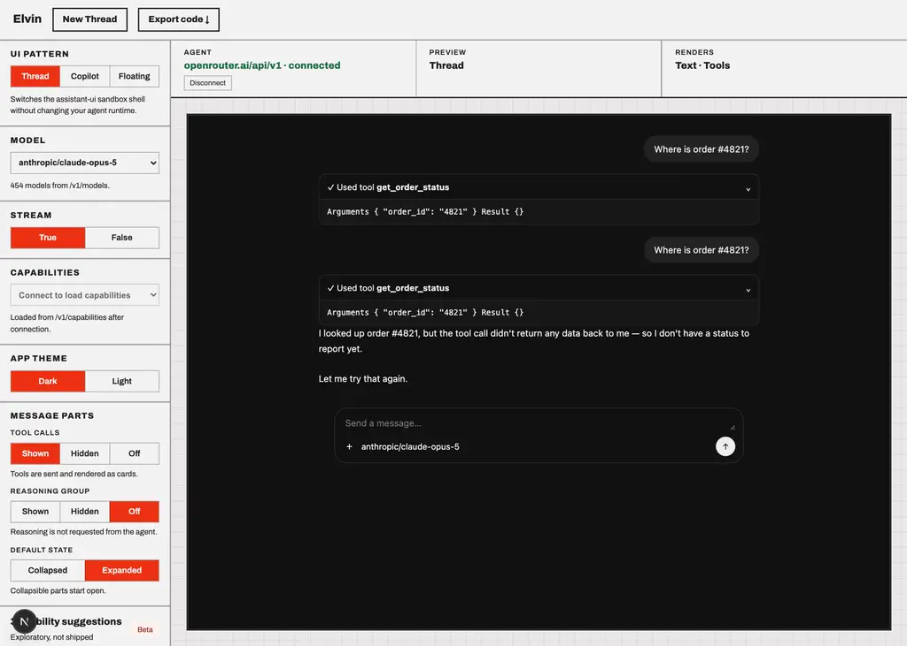
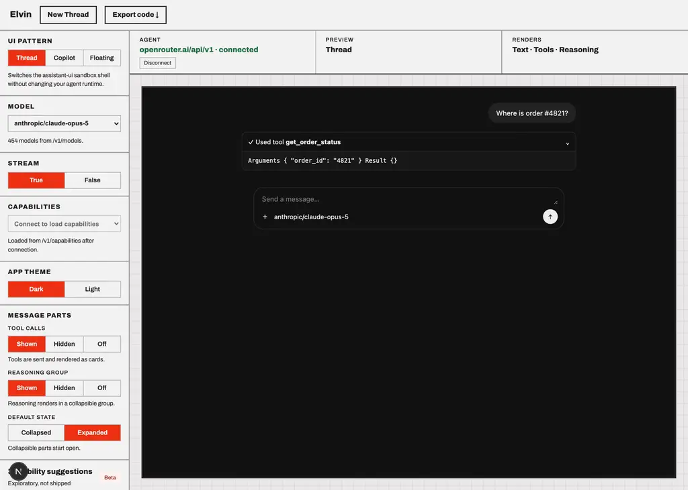

# anthropic/claude-opus-5

Probe of OpenRouter `anthropic/claude-opus-5` — reasoning and tool-calling, each toggled independently.

- Generated: 2026-09-23T09:38:53.241Z
- Endpoint: `POST https://openrouter.ai/api/v1/chat/completions` (streaming, `max_tokens: 2000`)
- Prompt: `Two things, please: (1) work out 17*23 step by step, and (2) call get_weather with city="Paris" for the current weather there. Show your working for the arithmetic.`
- Tool: `get_weather` (`type: "function"`, JSON Schema params, `tool_choice: "auto"`)

## Model metadata (from `GET /api/v1/models`)

```json
{
  "id": "anthropic/claude-opus-5",
  "name": "Anthropic: Claude Opus 5",
  "context_length": 1000000,
  "supported_parameters": [
    "include_reasoning",
    "max_completion_tokens",
    "max_tokens",
    "reasoning",
    "reasoning_effort",
    "response_format",
    "stop",
    "structured_outputs",
    "temperature",
    "tool_choice",
    "tools",
    "verbosity"
  ],
  "reasoning": {
    "mandatory": false,
    "default_enabled": true,
    "supported_efforts": [
      "max",
      "xhigh",
      "high",
      "medium",
      "low"
    ],
    "default_effort": "high"
  }
}
```

- declares `tools`: **true**
- declares `reasoning`: **true**

## Matrix

| reasoning | tools | HTTP | mode | reasoning? | kind | reasoning field | tool call? | args type | finish |
| --- | --- | --- | --- | --- | --- | --- | --- | --- | --- |
| on | on | 200 | stream | no | - | - | yes (get_weather) | string(JSON) | tool_calls |
| on | off | 200 | stream | yes (614 chars) | reasoning.text | delta.reasoning, delta.reasoning_details[].type|text|format|index, delta.reasoning_details[].type|signature|format|index | no | - | stop |
| off | on | 200 | stream | no | - | - | yes (get_weather) | string(JSON) | tool_calls |
| off | off | 200 | stream | no | - | - | no | - | stop |

## Toggle behaviour

- reasoning on → produced reasoning: **false**; off → produced reasoning: **false**
- tools on → tool call: **true**; tools off → tool call: **false**

## Key inventory (streamed chunks)

```
choices
choices[]
choices[].delta
choices[].delta.content
choices[].delta.reasoning
choices[].delta.reasoning_details
choices[].delta.reasoning_details[]
choices[].delta.reasoning_details[].format
choices[].delta.reasoning_details[].index
choices[].delta.reasoning_details[].signature
choices[].delta.reasoning_details[].text
choices[].delta.reasoning_details[].type
choices[].delta.role
choices[].delta.tool_calls
choices[].delta.tool_calls[]
choices[].delta.tool_calls[].function
choices[].delta.tool_calls[].function.arguments
choices[].delta.tool_calls[].function.name
choices[].delta.tool_calls[].id
choices[].delta.tool_calls[].index
choices[].delta.tool_calls[].type
choices[].finish_reason
choices[].index
choices[].native_finish_reason
created
id
model
object
provider
service_tier
usage
usage.completion_tokens
usage.completion_tokens_details
usage.completion_tokens_details.audio_tokens
usage.completion_tokens_details.image_tokens
usage.completion_tokens_details.reasoning_tokens
usage.cost
usage.cost_details
usage.cost_details.upstream_inference_completions_cost
usage.cost_details.upstream_inference_cost
usage.cost_details.upstream_inference_prompt_cost
usage.is_byok
usage.prompt_tokens
usage.prompt_tokens_details
usage.prompt_tokens_details.audio_tokens
usage.prompt_tokens_details.cache_write_tokens
usage.prompt_tokens_details.cached_tokens
usage.prompt_tokens_details.video_tokens
usage.total_tokens
```

## Raw evidence

### reasoning=on tools=on

- HTTP 200 in 3677ms, content-type `text/event-stream`, 12 SSE lines
- tool calls:

```json
[
  {
    "id": "toolu_016513YVuovkDA4zCscJfNDC",
    "name": "get_weather",
    "arguments": "{\"city\": \"Paris\"}",
    "argumentsType": "string(JSON)"
  }
]
```
- content:

```text
I'll do the arithmetic first, then fetch the weather.

**(1) 17 × 23, step by step**

Break 23 into 20 + 3:

- 17 × 20 = 340
- 17 × 3 = 51
- Add them: 340 + 51 = **391**

Quick check using a different split — break 17 into 10 + 7:
- 10 × 23 = 230
- 7 × 23 = 161
- 230 + 161 = 391 ✓

So **17 × 23 = 391**.

**(2) Fetching the Paris weather:**
```
- first SSE payloads verbatim:

```text
{"id":"gen-1790156307-FiCeFt6xWrBnoYHsFwx6","object":"chat.completion.chunk","created":1790156307,"model":"anthropic/claude-opus-5","provider":"Claude Platform on AWS","choices":[{"index":0,"delta":{"content":"I","role":"assistant"},"finish_reason":null,"native_finish_reason":null}]}
{"id":"gen-1790156307-FiCeFt6xWrBnoYHsFwx6","object":"chat.completion.chunk","created":1790156307,"model":"anthropic/claude-opus-5","provider":"Claude Platform on AWS","choices":[{"index":0,"delta":{"content":"'ll do","role":"assistant"},"finish_reason":null,"native_finish_reason":null}]}
{"id":"gen-1790156307-FiCeFt6xWrBnoYHsFwx6","object":"chat.completion.chunk","created":1790156307,"model":"anthropic/claude-opus-5","provider":"Claude Platform on AWS","choices":[{"index":0,"delta":{"content":" the arithmetic first, then fetch the weather.\n\n**(1) 17 × 23, step by step**\n\nBreak 23 into 20 + 3:\n\n- 17 × 20 = 340\n- 17 × 3 = 51\n-","role":"assistant"},"finish_reason":null,"native_finish_reason":null}]}
{"id":"gen-1790156307-FiCeFt6xWrBnoYHsFwx6","object":"chat.completion.chunk","created":1790156307,"model":"anthropic/claude-opus-5","provider":"Claude Platform on AWS","choices":[{"index":0,"delta":{"
```

### reasoning=on tools=off

- HTTP 200 in 10415ms, content-type `text/event-stream`, 23 SSE lines
- reasoning captured:

```text
II need to hand need to handle twole two requ requests: computests: computing ing 17*23 and calling a weather function, but no tools are actually available to me here. Working out the math: 17*23 breaks down as 17*20 + 17*3 = 340+51 = 391, and I'll need17*23 and calling a weather function, but no tools are actually available to me here. Working out the math: 17*23 breaks down as 17*20 + 17*3 = 340+51 = 391, and I'll need to explain honestly that I can't invoke the get_weather function since no tool was provided. to explain honestly that I can't invoke the get_weather function since no tool was provided.


```
- content:

```text
## (1) 17 × 23, step by step

**Method: break 23 into 20 + 3 (distributive property)**

1. 17 × 20 = 17 × 2 × 10 = 34 × 10 = **340**
2. 17 × 3 = **51**
3. Add the partial products: 340 + 51 = **391**

**Check with a different decomposition** (23 × 17 = 23 × 10 + 23 × 7):

1. 23 × 10 = 230
2. 23 × 7 = 161
3. 230 + 161 = **391** ✓

**Second check using a difference of squares trick:** 17 × 23 = (20 
```
- first SSE payloads verbatim:

```text
{"id":"gen-1790156311-Z3u49Dc9DRVlOAdqEF0S","object":"chat.completion.chunk","created":1790156311,"model":"anthropic/claude-opus-5","provider":"Claude Platform on AWS","choices":[{"index":0,"delta":{"content":"","role":"assistant","reasoning":"I","reasoning_details":[{"type":"reasoning.text","text":"I","format":"anthropic-claude-v1","index":0}]},"finish_reason":null,"native_finish_reason":null}]}
{"id":"gen-1790156311-Z3u49Dc9DRVlOAdqEF0S","object":"chat.completion.chunk","created":1790156311,"model":"anthropic/claude-opus-5","provider":"Claude Platform on AWS","choices":[{"index":0,"delta":{"content":"","role":"assistant","reasoning":" need to hand","reasoning_details":[{"type":"reasoning.text","text":" need to hand","format":"anthropic-claude-v1","index":0}]},"finish_reason":null,"native_finish_reason":null}]}
{"id":"gen-1790156311-Z3u49Dc9DRVlOAdqEF0S","object":"chat.completion.chunk","created":1790156311,"model":"anthropic/claude-opus-5","provider":"Claude Platform on AWS","choices":[{"index":0,"delta":{"content":"","role":"assistant","reasoning":"le two","reasoning_details":[{"type":"reasoning.text","text":"le two","format":"anthropic-claude-v1","index":0}]},"finish_reason":nu
```

### reasoning=off tools=on

- HTTP 200 in 3238ms, content-type `text/event-stream`, 11 SSE lines
- tool calls:

```json
[
  {
    "id": "toolu_01CKHZdpAJWyUTHwAoH6wEWF",
    "name": "get_weather",
    "arguments": "{\"city\": \"Paris\"}",
    "argumentsType": "string(JSON)"
  }
]
```
- content:

```text
I'll do the arithmetic and fetch the weather at the same time.

**17 × 23, step by step:**

Break 23 into 20 + 3:
- 17 × 20 = 340
- 17 × 3 = 51
- 340 + 51 = **391**

Check by breaking 17 into 10 + 7:
- 10 × 23 = 230
- 7 × 23 = 161
- 230 + 161 = **391** ✓

Now the weather:
```
- first SSE payloads verbatim:

```text
{"id":"gen-1790156321-RTEImx1BV14I3mcCOT6N","object":"chat.completion.chunk","created":1790156321,"model":"anthropic/claude-opus-5","provider":"Claude Platform on AWS","choices":[{"index":0,"delta":{"content":"I","role":"assistant"},"finish_reason":null,"native_finish_reason":null}]}
{"id":"gen-1790156321-RTEImx1BV14I3mcCOT6N","object":"chat.completion.chunk","created":1790156321,"model":"anthropic/claude-opus-5","provider":"Claude Platform on AWS","choices":[{"index":0,"delta":{"content":"'ll do the arithmetic and fetch the weather at the same time.\n\n**17 × 23, step by step:**\n\nBreak 23 into 20 + 3:\n- 17 × 20 = 340\n- 17 × 3 = 51","role":"assistant"},"finish_reason":null,"native_finish_reason":null}]}
{"id":"gen-1790156321-RTEImx1BV14I3mcCOT6N","object":"chat.completion.chunk","created":1790156321,"model":"anthropic/claude-opus-5","provider":"Claude Platform on AWS","choices":[{"index":0,"delta":{"content":"\n- 340 + 51 = **391**\n\nCheck by breaking 17 into 10 + 7:\n- 10 × 23 = 230\n- 7 × 23 = 161\n- 230 + 161 = **391** ✓\n\nNow the","role":"assistant"},"finish_reason":null,"native_finish_reason":null}]}
{"id":"gen-1790156321-RTEImx1BV14I3mcCOT6N","object":"chat.completion.c
```

### reasoning=off tools=off

- HTTP 200 in 8247ms, content-type `text/event-stream`, 14 SSE lines
- content:

```text
Happy to help with both — one of these I can do, and one I can't, so let me be upfront about that.

**(1) 17 × 23, step by step**

I'll break 23 into 20 + 3 and use the distributive property:

- 17 × 20 = 340
- 17 × 3 = 51
- 340 + 51 = **391**

Let me verify with a different decomposition, splitting 17 into 10 + 7:

- 10 × 23 = 230
- 7 × 23 = 161
- 230 + 161 = **391**

Both methods agree, so **17 
```
- first SSE payloads verbatim:

```text
{"id":"gen-1790156325-CdhMLJUTpCEsULUX5LVX","object":"chat.completion.chunk","created":1790156325,"model":"anthropic/claude-opus-5","provider":"Claude Platform on AWS","choices":[{"index":0,"delta":{"content":"Happ","role":"assistant"},"finish_reason":null,"native_finish_reason":null}]}
{"id":"gen-1790156325-CdhMLJUTpCEsULUX5LVX","object":"chat.completion.chunk","created":1790156325,"model":"anthropic/claude-opus-5","provider":"Claude Platform on AWS","choices":[{"index":0,"delta":{"content":"y to help with both — one of these I can do, and one I can't, so let me be upfront about that.\n\n**(1) 17 × 23, step by step**\n\nI'll break 23 into 20","role":"assistant"},"finish_reason":null,"native_finish_reason":null}]}
{"id":"gen-1790156325-CdhMLJUTpCEsULUX5LVX","object":"chat.completion.chunk","created":1790156325,"model":"anthropic/claude-opus-5","provider":"Claude Platform on AWS","choices":[{"index":0,"delta":{"content":" + 3 and use the distributive property:\n\n- 17 × 20 = 340\n- 17 × 3 = 51\n- 340 + 51 = **391**\n\nLet me verify with a different decomposition,","role":"assistant"},"finish_reason":null,"native_finish_reason":null}]}
{"id":"gen-1790156325-CdhMLJUTpCEsULUX5LVX","obj
```

## Screenshots (Elvin testbed against this model)



