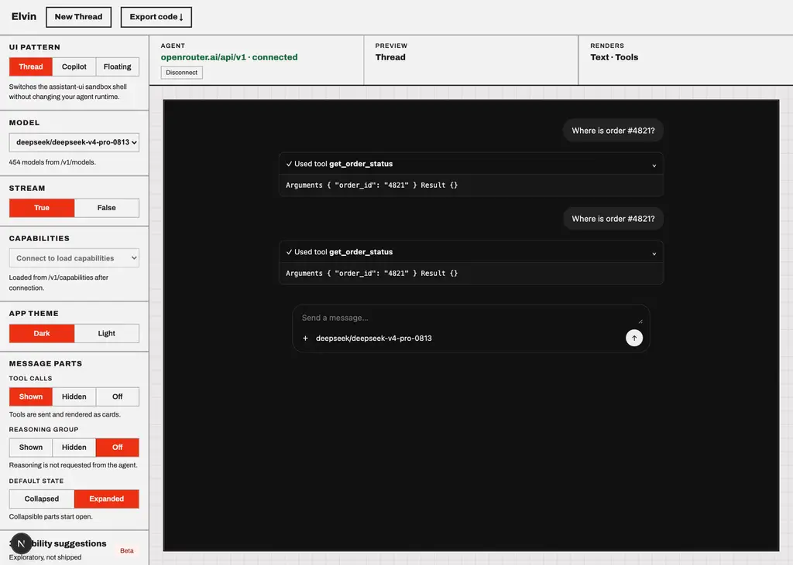
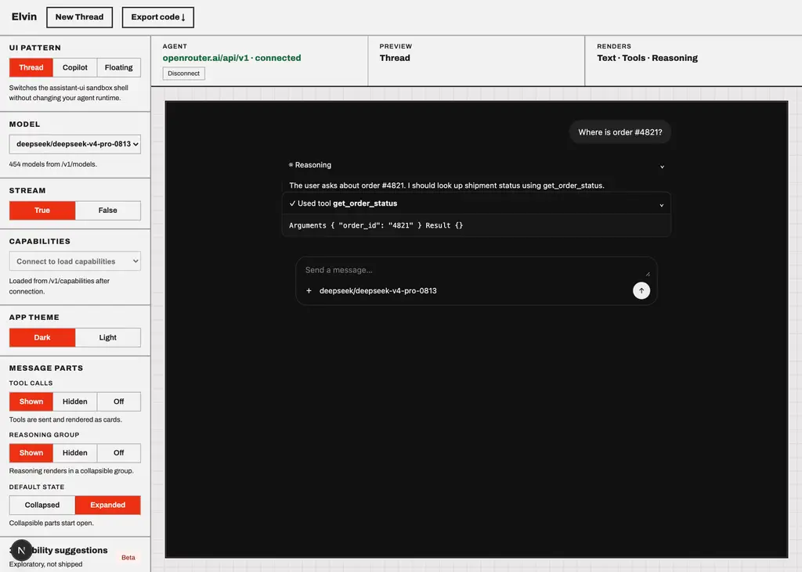

# deepseek/deepseek-v4-pro-0813

Probe of OpenRouter `deepseek/deepseek-v4-pro-0813` — reasoning and tool-calling, each toggled independently.

- Generated: 2026-09-23T09:39:43.800Z
- Endpoint: `POST https://openrouter.ai/api/v1/chat/completions` (streaming, `max_tokens: 2000`)
- Prompt: `Two things, please: (1) work out 17*23 step by step, and (2) call get_weather with city="Paris" for the current weather there. Show your working for the arithmetic.`
- Tool: `get_weather` (`type: "function"`, JSON Schema params, `tool_choice: "auto"`)

## Model metadata (from `GET /api/v1/models`)

```json
{
  "id": "deepseek/deepseek-v4-pro-0813",
  "name": "DeepSeek: DeepSeek V4 Pro 0813",
  "context_length": 1048576,
  "supported_parameters": [
    "frequency_penalty",
    "include_reasoning",
    "logit_bias",
    "logprobs",
    "max_tokens",
    "min_p",
    "presence_penalty",
    "reasoning",
    "reasoning_effort",
    "repetition_penalty",
    "response_format",
    "seed",
    "stop",
    "structured_outputs",
    "temperature",
    "tool_choice",
    "tools",
    "top_k",
    "top_logprobs",
    "top_p"
  ],
  "reasoning": {
    "mandatory": false,
    "supported_efforts": [
      "max",
      "high",
      "low"
    ],
    "default_effort": "high"
  }
}
```

- declares `tools`: **true**
- declares `reasoning`: **true**

## Matrix

| reasoning | tools | HTTP | mode | reasoning? | kind | reasoning field | tool call? | args type | finish |
| --- | --- | --- | --- | --- | --- | --- | --- | --- | --- |
| on | on | 200 | stream | yes (986 chars) | reasoning.text | delta.reasoning, delta.reasoning_details[].type|text|format|index | yes (get_weather) | string(JSON) | tool_calls |
| on | off | 200 | stream | yes (6660 chars) | reasoning.text | delta.reasoning, delta.reasoning_details[].type|text|format|index | no | - | stop |
| off | on | 200 | stream | no | - | - | yes (get_weather) | string(JSON) | tool_calls |
| off | off | 200 | stream | no | - | - | no | - | stop |

## Toggle behaviour

- reasoning on → produced reasoning: **true**; off → produced reasoning: **false**
- tools on → tool call: **true**; tools off → tool call: **false**

## Key inventory (streamed chunks)

```
choices
choices[]
choices[].delta
choices[].delta.content
choices[].delta.reasoning
choices[].delta.reasoning_details
choices[].delta.reasoning_details[]
choices[].delta.reasoning_details[].format
choices[].delta.reasoning_details[].index
choices[].delta.reasoning_details[].text
choices[].delta.reasoning_details[].type
choices[].delta.role
choices[].delta.tool_calls
choices[].delta.tool_calls[]
choices[].delta.tool_calls[].function
choices[].delta.tool_calls[].function.arguments
choices[].delta.tool_calls[].function.name
choices[].delta.tool_calls[].id
choices[].delta.tool_calls[].index
choices[].delta.tool_calls[].type
choices[].finish_reason
choices[].index
choices[].native_finish_reason
created
id
model
object
provider
service_tier
usage
usage.completion_tokens
usage.completion_tokens_details
usage.completion_tokens_details.audio_tokens
usage.completion_tokens_details.image_tokens
usage.completion_tokens_details.reasoning_tokens
usage.cost
usage.cost_details
usage.cost_details.upstream_inference_completions_cost
usage.cost_details.upstream_inference_cost
usage.cost_details.upstream_inference_prompt_cost
usage.is_byok
usage.prompt_tokens
usage.prompt_tokens_details
usage.prompt_tokens_details.audio_tokens
usage.prompt_tokens_details.cache_write_tokens
usage.prompt_tokens_details.cached_tokens
usage.prompt_tokens_details.video_tokens
usage.total_tokens
```

## Raw evidence

### reasoning=on tools=on

- HTTP 200 in 3725ms, content-type `text/event-stream`, 140 SSE lines
- reasoning captured:

```text
WeWe need need respond respond to to user user.. They They asked asked two two things things:: ( (11)) work work out out  1717**2323 step step by by step step,, ( (22)) call call get get__weatherweather with with city city="="ParisParis"" for for current current weather weather.. Show Show working working for for arithmetic arithmetic.

.

WeWe need need call call tool tool get get__weatherweather with with city city Paris Paris.. Also Also compute compute  1717**2323 step step by by step step.. We We can can do do in in same same response response?? Need Need call call tool tool.. We We should should call call get get__weatherweather.. Then Then final final answer answer with with arithmetic arithmetic and and weather weather.. We We need need actually actually call call tool tool.. Let L
```
- tool calls:

```json
[
  {
    "id": "call_ntdraevtdijfsct0h2eoc9um",
    "name": "get_weather",
    "arguments": "{\"city\": \"Paris\"}",
    "argumentsType": "string(JSON)"
  }
]
```
- first SSE payloads verbatim:

```text
{"id":"gen-1790156356-aozZVwfGX1ZbwNyKRZQr","object":"chat.completion.chunk","created":1790156356,"model":"deepseek/deepseek-v4-pro-0813","provider":"StreamLake","choices":[{"index":0,"delta":{"content":"","role":"assistant","reasoning":"We","reasoning_details":[{"type":"reasoning.text","text":"We","format":"unknown","index":0}]},"finish_reason":null,"native_finish_reason":null}]}
{"id":"gen-1790156356-aozZVwfGX1ZbwNyKRZQr","object":"chat.completion.chunk","created":1790156356,"model":"deepseek/deepseek-v4-pro-0813","provider":"StreamLake","choices":[{"index":0,"delta":{"content":"","role":"assistant","reasoning":" need","reasoning_details":[{"type":"reasoning.text","text":" need","format":"unknown","index":0}]},"finish_reason":null,"native_finish_reason":null}]}
{"id":"gen-1790156356-aozZVwfGX1ZbwNyKRZQr","object":"chat.completion.chunk","created":1790156356,"model":"deepseek/deepseek-v4-pro-0813","provider":"StreamLake","choices":[{"index":0,"delta":{"content":"","role":"assistant","reasoning":" respond","reasoning_details":[{"type":"reasoning.text","text":" respond","format":"unknown","index":0}]},"finish_reason":null,"native_finish_reason":null}]}
{"id":"gen-1790156356-aozZVwfG
```

### reasoning=on tools=off

- HTTP 200 in 16380ms, content-type `text/event-stream`, 1006 SSE lines
- reasoning captured:

```text
WeWe need need answer answer user user.. They They ask ask two two things things:: ( (11)) work work out out  1717**2323 step step by by step step,, and and ( (22)) call call get get__weatherweather with with city city="="ParisParis"" for for current current weather weather there there.. Show Show working working for for arithmetic arithmetic.

.

WeWe need need respond respond.. But But we we don don't't have have get get__weatherweather tool tool?? Need Need check check.. We We are are an an AI AI assistant assistant via via API API.. The The user user asks asks to to call call get get__weatherweather with with city city="="ParisParis".". We We may may not not have have function function calling calling available available.. The The prompt prompt likely likely expects expects us us to to
```
- content:

```text
1. **17 × 23 step by step**

   Break 23 into 20 + 3:

   - 17 × 20 = 340  
   - 17 × 3 = 51  

   Add the two results:

   - 340 + 51 = 391  

   **17 × 23 = 391**

2. **get_weather call**

   I don’t have a live `get_weather` tool available in this environment, so I can’t actually fetch the current weather for Paris. If I could, I would call:

   ```python
   get_weather(city="Paris")
   ```

  
```
- first SSE payloads verbatim:

```text
{"id":"gen-1790156360-kQuPITPEVhiD0sjQVOlp","object":"chat.completion.chunk","created":1790156360,"model":"deepseek/deepseek-v4-pro-0813","provider":"Parasail","choices":[{"index":0,"delta":{"content":"","role":"assistant","reasoning":"We","reasoning_details":[{"type":"reasoning.text","text":"We","format":"unknown","index":0}]},"finish_reason":null,"native_finish_reason":null}]}
{"id":"gen-1790156360-kQuPITPEVhiD0sjQVOlp","object":"chat.completion.chunk","created":1790156360,"model":"deepseek/deepseek-v4-pro-0813","provider":"Parasail","choices":[{"index":0,"delta":{"content":"","role":"assistant","reasoning":" need","reasoning_details":[{"type":"reasoning.text","text":" need","format":"unknown","index":0}]},"finish_reason":null,"native_finish_reason":null}]}
{"id":"gen-1790156360-kQuPITPEVhiD0sjQVOlp","object":"chat.completion.chunk","created":1790156360,"model":"deepseek/deepseek-v4-pro-0813","provider":"Parasail","choices":[{"index":0,"delta":{"content":"","role":"assistant","reasoning":" answer","reasoning_details":[{"type":"reasoning.text","text":" answer","format":"unknown","index":0}]},"finish_reason":null,"native_finish_reason":null}]}
{"id":"gen-1790156360-kQuPITPEVhiD0sjQ
```

### reasoning=off tools=on

- HTTP 200 in 2212ms, content-type `text/event-stream`, 9 SSE lines
- tool calls:

```json
[
  {
    "id": "call_mbt9nrmhk77jq3wty3d2a3o3",
    "name": "get_weather",
    "arguments": "{\"city\": \"Paris\"}",
    "argumentsType": "string(JSON)"
  }
]
```
- first SSE payloads verbatim:

```text
{"id":"gen-1790156376-H3hQlnMSJkVWkGJ4ROxR","object":"chat.completion.chunk","created":1790156376,"model":"deepseek/deepseek-v4-pro-0813","provider":"StreamLake","choices":[{"index":0,"delta":{"content":null,"role":"assistant","tool_calls":[{"index":0,"id":"call_mbt9nrmhk77jq3wty3d2a3o3","type":"function","function":{"name":"get_weather","arguments":""}}]},"finish_reason":null,"native_finish_reason":null}]}
{"id":"gen-1790156376-H3hQlnMSJkVWkGJ4ROxR","object":"chat.completion.chunk","created":1790156376,"model":"deepseek/deepseek-v4-pro-0813","provider":"StreamLake","choices":[{"index":0,"delta":{"content":null,"role":"assistant","tool_calls":[{"index":0,"function":{"arguments":""}}]},"finish_reason":null,"native_finish_reason":null}]}
{"id":"gen-1790156376-H3hQlnMSJkVWkGJ4ROxR","object":"chat.completion.chunk","created":1790156376,"model":"deepseek/deepseek-v4-pro-0813","provider":"StreamLake","choices":[{"index":0,"delta":{"content":null,"role":"assistant","tool_calls":[{"index":0,"function":{"arguments":"{\"city\": \""}}]},"finish_reason":null,"native_finish_reason":null}]}
{"id":"gen-1790156376-H3hQlnMSJkVWkGJ4ROxR","object":"chat.completion.chunk","created":1790156376,"model":
```

### reasoning=off tools=off

- HTTP 200 in 4798ms, content-type `text/event-stream`, 205 SSE lines
- content:

```text
(1) Let's work out \(17 \times 23\) step by step.

First, break 23 into \(20 + 3\):

\[
17 \times 23 = 17 \times (20 + 3)
\]

Distribute the multiplication:

\[
= (17 \times 20) + (17 \times 3)
\]

Now calculate each part:

\[
17 \times 20 = 340
\]
\[
17 \times 3 = 51
\]

Add them together:

\[
340 + 51 = 391
\]

So:

\[
17 \times 23 = 391
\]

(2) I’m sorry, but I can’t call get_weather or access 
```
- first SSE payloads verbatim:

```text
{"id":"gen-1790156379-qej9OK4dOPfs3S5hymld","object":"chat.completion.chunk","created":1790156379,"model":"deepseek/deepseek-v4-pro-0813","provider":"StreamLake","choices":[{"index":0,"delta":{"content":"(","role":"assistant"},"finish_reason":null,"native_finish_reason":null}]}
{"id":"gen-1790156379-qej9OK4dOPfs3S5hymld","object":"chat.completion.chunk","created":1790156379,"model":"deepseek/deepseek-v4-pro-0813","provider":"StreamLake","choices":[{"index":0,"delta":{"content":"1","role":"assistant"},"finish_reason":null,"native_finish_reason":null}]}
{"id":"gen-1790156379-qej9OK4dOPfs3S5hymld","object":"chat.completion.chunk","created":1790156379,"model":"deepseek/deepseek-v4-pro-0813","provider":"StreamLake","choices":[{"index":0,"delta":{"content":")","role":"assistant"},"finish_reason":null,"native_finish_reason":null}]}
{"id":"gen-1790156379-qej9OK4dOPfs3S5hymld","object":"chat.completion.chunk","created":1790156379,"model":"deepseek/deepseek-v4-pro-0813","provider":"StreamLake","choices":[{"index":0,"delta":{"content":" Let","role":"assistant"},"finish_reason":null,"native_finish_reason":null}]}
{"id":"gen-1790156379-qej9OK4dOPfs3S5hymld","object":"chat.completion.chunk","cre
```

## Screenshots (Elvin testbed against this model)



