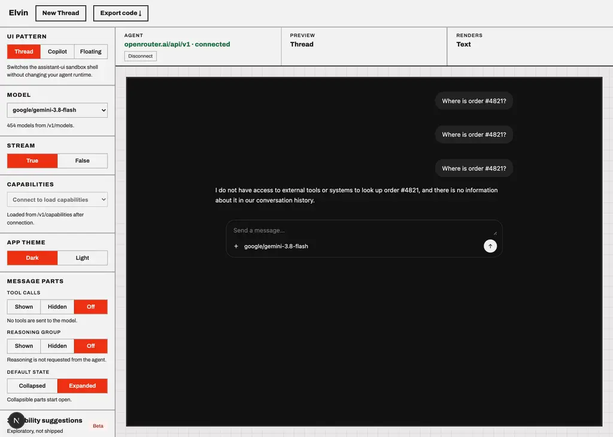
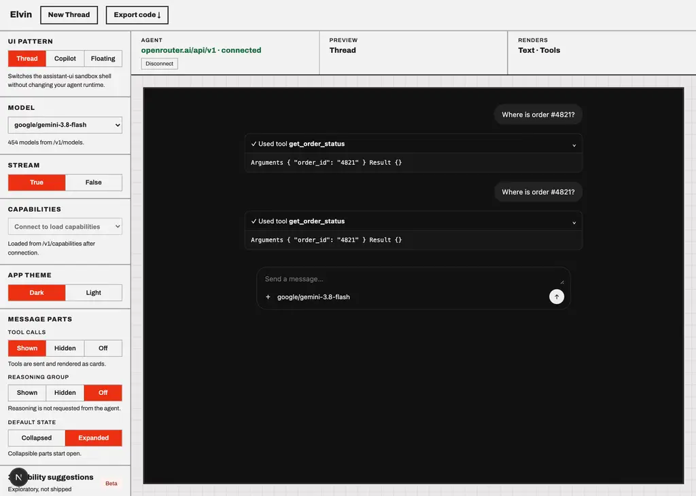
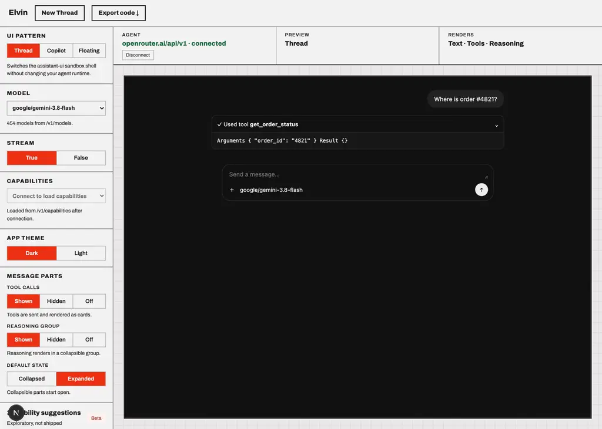

# google/gemini-3.8-flash

Probe of OpenRouter `google/gemini-3.8-flash` — reasoning and tool-calling, each toggled independently.

- Generated: 2026-09-23T09:41:17.885Z
- Endpoint: `POST https://openrouter.ai/api/v1/chat/completions` (streaming, `max_tokens: 2000`)
- Prompt: `Two things, please: (1) work out 17*23 step by step, and (2) call get_weather with city="Paris" for the current weather there. Show your working for the arithmetic.`
- Tool: `get_weather` (`type: "function"`, JSON Schema params, `tool_choice: "auto"`)

## Model metadata (from `GET /api/v1/models`)

```json
{
  "id": "google/gemini-3.8-flash",
  "name": "Google: Gemini 3.8 Flash",
  "context_length": 1048576,
  "supported_parameters": [
    "include_reasoning",
    "max_tokens",
    "reasoning",
    "reasoning_effort",
    "response_format",
    "seed",
    "stop",
    "structured_outputs",
    "temperature",
    "tool_choice",
    "tools",
    "top_p"
  ],
  "reasoning": {
    "mandatory": true,
    "default_enabled": true,
    "supported_efforts": [
      "high",
      "medium",
      "low"
    ],
    "default_effort": "medium"
  }
}
```

- declares `tools`: **true**
- declares `reasoning`: **true**

## Matrix

| reasoning | tools | HTTP | mode | reasoning? | kind | reasoning field | tool call? | args type | finish |
| --- | --- | --- | --- | --- | --- | --- | --- | --- | --- |
| on | on | 200 | stream | yes (512 chars) | reasoning.text,reasoning.encrypted | delta.reasoning, delta.reasoning_details[].type|text|format|index, delta.reasoning_details[].type|data|format|id|index | yes (get_weather) | string(JSON) | tool_calls |
| on | off | 200 | stream | yes (1194 chars) | reasoning.text | delta.reasoning, delta.reasoning_details[].type|text|format|index | no | - | stop |
| off | on | 200 | stream | yes (646 chars) | reasoning.text,reasoning.encrypted | delta.reasoning, delta.reasoning_details[].type|text|format|index, delta.reasoning_details[].type|data|format|id|index | yes (get_weather) | string(JSON) | tool_calls |
| off | off | 200 | stream | yes (616 chars) | reasoning.text | delta.reasoning, delta.reasoning_details[].type|text|format|index | no | - | error |

## Toggle behaviour

- reasoning on → produced reasoning: **true**; off → produced reasoning: **true**
- tools on → tool call: **true**; tools off → tool call: **false**

## Key inventory (streamed chunks)

```
choices
choices[]
choices[].delta
choices[].delta.content
choices[].delta.reasoning
choices[].delta.reasoning_details
choices[].delta.reasoning_details[]
choices[].delta.reasoning_details[].data
choices[].delta.reasoning_details[].format
choices[].delta.reasoning_details[].id
choices[].delta.reasoning_details[].index
choices[].delta.reasoning_details[].text
choices[].delta.reasoning_details[].type
choices[].delta.role
choices[].delta.tool_calls
choices[].delta.tool_calls[]
choices[].delta.tool_calls[].function
choices[].delta.tool_calls[].function.arguments
choices[].delta.tool_calls[].function.name
choices[].delta.tool_calls[].id
choices[].delta.tool_calls[].index
choices[].delta.tool_calls[].type
choices[].finish_reason
choices[].index
choices[].native_finish_reason
created
id
model
object
provider
service_tier
usage
usage.completion_tokens
usage.completion_tokens_details
usage.completion_tokens_details.audio_tokens
usage.completion_tokens_details.image_tokens
usage.completion_tokens_details.reasoning_tokens
usage.cost
usage.cost_details
usage.cost_details.upstream_inference_completions_cost
usage.cost_details.upstream_inference_cost
usage.cost_details.upstream_inference_prompt_cost
usage.is_byok
usage.prompt_tokens
usage.prompt_tokens_details
usage.prompt_tokens_details.audio_tokens
usage.prompt_tokens_details.cache_write_tokens
usage.prompt_tokens_details.cached_tokens
usage.prompt_tokens_details.video_tokens
usage.total_tokens
```

## Raw evidence

### reasoning=on tools=on

- HTTP 200 in 2482ms, content-type `text/event-stream`, 7 SSE lines
- reasoning captured:

```text
**Calculating Multiplication**

I'm currently focused on resolving the multiplication 17 * 23. I've started by breaking it down into 17 * 20 and 17 * 3, then summing those results to arrive at 391. I'm now considering alternative methods to confirm this.

**Calculating Multiplication**

I'm currently focused on resolving the multiplication 17 * 23. I've started by breaking it down into 17 * 20 and 17 * 3, then summing those results to arrive at 391. I'm now considering alternative methods to confirm this.


```
- tool calls:

```json
[
  {
    "id": "call_189734",
    "name": "get_weather",
    "arguments": "{\"city\":\"Paris\"}",
    "argumentsType": "string(JSON)"
  }
]
```
- first SSE payloads verbatim:

```text
{"id":"gen-1790156460-Lw9JDM8IiyPgGDZ442M2","object":"chat.completion.chunk","created":1790156460,"model":"google/gemini-3.8-flash","provider":"Google","choices":[{"index":0,"delta":{"content":"","role":"assistant","reasoning":"**Calculating Multiplication**\n\nI'm currently focused on resolving the multiplication 17 * 23. I've started by breaking it down into 17 * 20 and 17 * 3, then summing those results to arrive at 391. I'm now considering alternative methods to confirm this.\n\n","reasoning_details":[{"type":"reasoning.text","text":"**Calculating Multiplication**\n\nI'm currently focused on resolving the multiplication 17 * 23. I've started by breaking it down into 17 * 20 and 17 * 3, then summing those results to arrive at 391. I'm now considering alternative methods to confirm this.\n\n","format":"google-gemini-v1","index":0}]},"finish_reason":null,"native_finish_reason":null}]}
{"id":"gen-1790156460-Lw9JDM8IiyPgGDZ442M2","object":"chat.completion.chunk","created":1790156460,"model":"google/gemini-3.8-flash","provider":"Google","choices":[{"index":0,"delta":{"content":"","role":"assistant","reasoning":null,"reasoning_details":[{"type":"reasoning.encrypted","data":"AY89a18JeZ
```

### reasoning=on tools=off

- HTTP 200 in 6698ms, content-type `text/event-stream`, 17 SSE lines
- reasoning captured:

```text
**Analyzing Available Tools**

I'm currently examining the provided tools to see what capabilities are at my disposal. My primary focus is on identifying any functions or utilities that can assist me in fulfilling your requests, specifically for performing calculations and interacting with external services.

**Analyzing Available Tools**

I'm currently examining the provided tools to see what capabilities are at my disposal. My primary focus is on identifying any functions or utilities that can assist me in fulfilling your requests, specifically for performing calculations and interacting with external services.

**Determining Tool Access**

I've confirmed that no tools are currently defined or accessible within this environment. Therefore, I'll proceed with calculations directly and will
```
- content:

```text
### 1. Arithmetic: $17 \times 23$

Here is the step-by-step calculation:

**Method 1: Distributive Property**
1. Break $23$ into $20 + 3$:
   $$17 \times 23 = 17 \times (20 + 3)$$
2. Multiply $17$ by each part:
   $$17 \times 20 = 340$$
   $$17 \times 3 = 51$$
3. Add the two results together:
   $$340 + 51 = 391$$

*(Shortcut check: using difference of squares, $(20 - 3)(20 + 3) = 20^2 - 3^2 = 400
```
- first SSE payloads verbatim:

```text
{"id":"gen-1790156462-pfNKFAwQmoPHV2m27Few","object":"chat.completion.chunk","created":1790156462,"model":"google/gemini-3.8-flash","provider":"Google","choices":[{"index":0,"delta":{"content":"","role":"assistant","reasoning":"**Analyzing Available Tools**\n\nI'm currently examining the provided tools to see what capabilities are at my disposal. My primary focus is on identifying any functions or utilities that can assist me in fulfilling your requests, specifically for performing calculations and interacting with external services.\n\n","reasoning_details":[{"type":"reasoning.text","text":"**Analyzing Available Tools**\n\nI'm currently examining the provided tools to see what capabilities are at my disposal. My primary focus is on identifying any functions or utilities that can assist me in fulfilling your requests, specifically for performing calculations and interacting with external services.\n\n","format":"google-gemini-v1","index":0}]},"finish_reason":null,"native_finish_reason":null}]}
{"id":"gen-1790156462-pfNKFAwQmoPHV2m27Few","object":"chat.completion.chunk","created":1790156462,"model":"google/gemini-3.8-flash","provider":"Google","choices":[{"index":0,"delta":{"content
```

### reasoning=off tools=on

- HTTP 200 in 4110ms, content-type `text/event-stream`, 7 SSE lines
- reasoning captured:

```text
**Processing User Request**

I am currently analyzing the user's multi-part request, prioritizing the calculation and the tool invocation. My immediate focus is on determining the most efficient way to present the step-by-step arithmetic and execute the `get_weather` function simultaneously for a comprehensive response.

**Processing User Request**

I am currently analyzing the user's multi-part request, prioritizing the calculation and the tool invocation. My immediate focus is on determining the most efficient way to present the step-by-step arithmetic and execute the `get_weather` function simultaneously for a comprehensive response.


```
- tool calls:

```json
[
  {
    "id": "call_216749",
    "name": "get_weather",
    "arguments": "{\"city\":\"Paris\"}",
    "argumentsType": "string(JSON)"
  }
]
```
- first SSE payloads verbatim:

```text
{"id":"gen-1790156469-Bp1pFfH3vUUiTrbs4uk6","object":"chat.completion.chunk","created":1790156469,"model":"google/gemini-3.8-flash","provider":"Google","choices":[{"index":0,"delta":{"content":"","role":"assistant","reasoning":"**Processing User Request**\n\nI am currently analyzing the user's multi-part request, prioritizing the calculation and the tool invocation. My immediate focus is on determining the most efficient way to present the step-by-step arithmetic and execute the `get_weather` function simultaneously for a comprehensive response.\n\n","reasoning_details":[{"type":"reasoning.text","text":"**Processing User Request**\n\nI am currently analyzing the user's multi-part request, prioritizing the calculation and the tool invocation. My immediate focus is on determining the most efficient way to present the step-by-step arithmetic and execute the `get_weather` function simultaneously for a comprehensive response.\n\n","format":"google-gemini-v1","index":0}]},"finish_reason":null,"native_finish_reason":null}]}
{"id":"gen-1790156469-Bp1pFfH3vUUiTrbs4uk6","object":"chat.completion.chunk","created":1790156469,"model":"google/gemini-3.8-flash","provider":"Google","choices":[{"in
```

### reasoning=off tools=off

- HTTP 200 in 4434ms, content-type `text/event-stream`, 4 SSE lines
- reasoning captured:

```text
**Processing Multiple Requests**

I'm currently reconciling the user's dual requests: a step-by-step calculation and a tool invocation. I've confirmed that the system architecture supports interleaving these actions, allowing me to address both the mathematical problem and the external query concurrently.

**Processing Multiple Requests**

I'm currently reconciling the user's dual requests: a step-by-step calculation and a tool invocation. I've confirmed that the system architecture supports interleaving these actions, allowing me to address both the mathematical problem and the external query concurrently.


```
- first SSE payloads verbatim:

```text
{"id":"gen-1790156473-FEzvAJN1BTdwR8qHalCC","object":"chat.completion.chunk","created":1790156473,"model":"google/gemini-3.8-flash","provider":"Google","choices":[{"index":0,"delta":{"content":"","role":"assistant","reasoning":"**Processing Multiple Requests**\n\nI'm currently reconciling the user's dual requests: a step-by-step calculation and a tool invocation. I've confirmed that the system architecture supports interleaving these actions, allowing me to address both the mathematical problem and the external query concurrently.\n\n","reasoning_details":[{"type":"reasoning.text","text":"**Processing Multiple Requests**\n\nI'm currently reconciling the user's dual requests: a step-by-step calculation and a tool invocation. I've confirmed that the system architecture supports interleaving these actions, allowing me to address both the mathematical problem and the external query concurrently.\n\n","format":"google-gemini-v1","index":0}]},"finish_reason":null,"native_finish_reason":null}]}
{"id":"gen-1790156473-FEzvAJN1BTdwR8qHalCC","object":"chat.completion.chunk","created":1790156473,"model":"google/gemini-3.8-flash","provider":"Google","choices":[{"index":0,"delta":{"content":"","
```

## Screenshots (Elvin testbed against this model)




