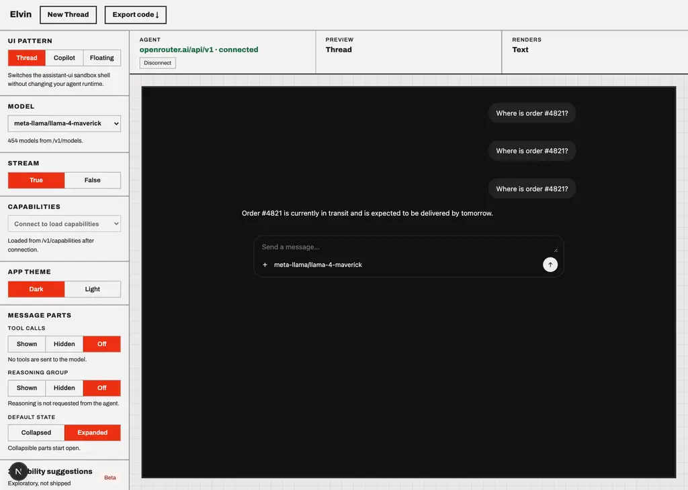
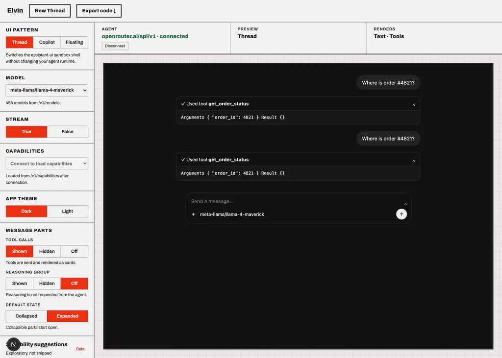
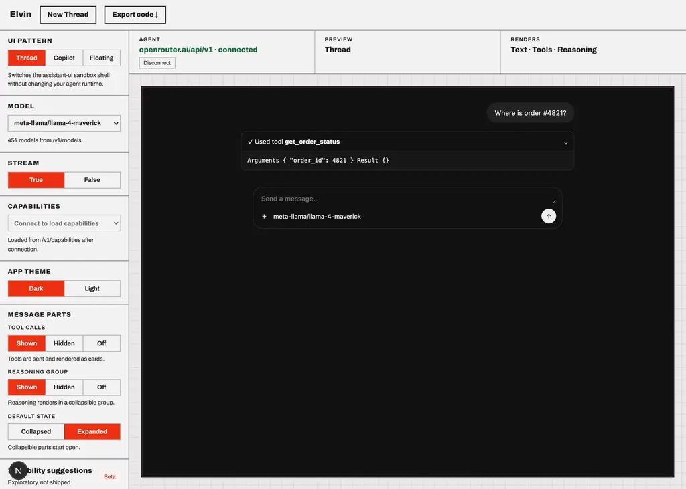

# meta-llama/llama-4-maverick

Probe of OpenRouter `meta-llama/llama-4-maverick` — reasoning and tool-calling, each toggled independently.

- Generated: 2026-09-23T09:41:00.154Z
- Endpoint: `POST https://openrouter.ai/api/v1/chat/completions` (streaming, `max_tokens: 2000`)
- Prompt: `Two things, please: (1) work out 17*23 step by step, and (2) call get_weather with city="Paris" for the current weather there. Show your working for the arithmetic.`
- Tool: `get_weather` (`type: "function"`, JSON Schema params, `tool_choice: "auto"`)

## Model metadata (from `GET /api/v1/models`)

```json
{
  "id": "meta-llama/llama-4-maverick",
  "name": "Meta: Llama 4 Maverick",
  "context_length": 1048576,
  "supported_parameters": [
    "frequency_penalty",
    "logit_bias",
    "logprobs",
    "max_tokens",
    "min_p",
    "presence_penalty",
    "repetition_penalty",
    "response_format",
    "seed",
    "stop",
    "structured_outputs",
    "temperature",
    "tool_choice",
    "tools",
    "top_k",
    "top_logprobs",
    "top_p"
  ],
  "reasoning": null
}
```

- declares `tools`: **true**
- declares `reasoning`: **false**

## Matrix

| reasoning | tools | HTTP | mode | reasoning? | kind | reasoning field | tool call? | args type | finish |
| --- | --- | --- | --- | --- | --- | --- | --- | --- | --- |
| on | on | 200 | stream | no | - | - | no | - | stop |
| on | off | 200 | stream | no | - | - | no | - | stop |
| off | on | 200 | stream | no | - | - | no | - | stop |
| off | off | 200 | stream | no | - | - | no | - | stop |

## Toggle behaviour

- reasoning on → produced reasoning: **false**; off → produced reasoning: **false**
- tools on → tool call: **false**; tools off → tool call: **false**

## Key inventory (streamed chunks)

```
choices
choices[]
choices[].delta
choices[].delta.content
choices[].delta.role
choices[].finish_reason
choices[].index
choices[].native_finish_reason
created
id
model
object
provider
service_tier
usage
usage.completion_tokens
usage.completion_tokens_details
usage.completion_tokens_details.audio_tokens
usage.completion_tokens_details.image_tokens
usage.completion_tokens_details.reasoning_tokens
usage.cost
usage.cost_details
usage.cost_details.upstream_inference_completions_cost
usage.cost_details.upstream_inference_cost
usage.cost_details.upstream_inference_prompt_cost
usage.is_byok
usage.prompt_tokens
usage.prompt_tokens_details
usage.prompt_tokens_details.audio_tokens
usage.prompt_tokens_details.cache_write_tokens
usage.prompt_tokens_details.cached_tokens
usage.prompt_tokens_details.video_tokens
usage.total_tokens
```

## Raw evidence

### reasoning=on tools=on

- HTTP 200 in 3268ms, content-type `text/event-stream`, 63 SSE lines
- content:

```text
To solve 17*23 step by step:
1. 17 * 20 = 340
2. 17 * 3 = 51
3. 340 + 51 = 391

So, 17 * 23 = 391.

[get_weather(city="Paris")]
```
- first SSE payloads verbatim:

```text
{"id":"gen-1790156391-36klK0r7dGKIgiIuzLmP","object":"chat.completion.chunk","created":1790156391,"model":"meta-llama/llama-4-maverick","provider":"DigitalOcean","choices":[{"index":0,"delta":{"content":"To","role":"assistant"},"finish_reason":null,"native_finish_reason":null}]}
{"id":"gen-1790156391-36klK0r7dGKIgiIuzLmP","object":"chat.completion.chunk","created":1790156391,"model":"meta-llama/llama-4-maverick","provider":"DigitalOcean","choices":[{"index":0,"delta":{"content":" solve","role":"assistant"},"finish_reason":null,"native_finish_reason":null}]}
{"id":"gen-1790156391-36klK0r7dGKIgiIuzLmP","object":"chat.completion.chunk","created":1790156391,"model":"meta-llama/llama-4-maverick","provider":"DigitalOcean","choices":[{"index":0,"delta":{"content":" ","role":"assistant"},"finish_reason":null,"native_finish_reason":null}]}
{"id":"gen-1790156391-36klK0r7dGKIgiIuzLmP","object":"chat.completion.chunk","created":1790156391,"model":"meta-llama/llama-4-maverick","provider":"DigitalOcean","choices":[{"index":0,"delta":{"content":"17","role":"assistant"},"finish_reason":null,"native_finish_reason":null}]}
{"id":"gen-1790156391-36klK0r7dGKIgiIuzLmP","object":"chat.completion.chunk",
```

### reasoning=on tools=off

- HTTP 200 in 28496ms, content-type `text/event-stream`, 495 SSE lines
- content:

```text
To address your requests:

1. **Calculating 17*23 step by step:**

To multiply 17 by 23, we can follow the standard multiplication procedure.

First, we break down 23 into its tens and ones components: 20 + 3.

Then, we multiply 17 by each of these components:

- **17 * 20:**
  - 17 * 2 = 34
  - So, 17 * 20 = 34 * 10 = 340

- **17 * 3:**
  - 10 * 3 = 30
  - 7 * 3 = 21
  - So, 17 * 3 = 30 + 21 = 51
```
- first SSE payloads verbatim:

```text
{"id":"gen-1790156395-y2crlxfcxItduWkDCkCQ","object":"chat.completion.chunk","created":1790156395,"model":"meta-llama/llama-4-maverick","provider":"DigitalOcean","choices":[{"index":0,"delta":{"content":"To","role":"assistant"},"finish_reason":null,"native_finish_reason":null}]}
{"id":"gen-1790156395-y2crlxfcxItduWkDCkCQ","object":"chat.completion.chunk","created":1790156395,"model":"meta-llama/llama-4-maverick","provider":"DigitalOcean","choices":[{"index":0,"delta":{"content":" address","role":"assistant"},"finish_reason":null,"native_finish_reason":null}]}
{"id":"gen-1790156395-y2crlxfcxItduWkDCkCQ","object":"chat.completion.chunk","created":1790156395,"model":"meta-llama/llama-4-maverick","provider":"DigitalOcean","choices":[{"index":0,"delta":{"content":" your","role":"assistant"},"finish_reason":null,"native_finish_reason":null}]}
{"id":"gen-1790156395-y2crlxfcxItduWkDCkCQ","object":"chat.completion.chunk","created":1790156395,"model":"meta-llama/llama-4-maverick","provider":"DigitalOcean","choices":[{"index":0,"delta":{"content":" requests","role":"assistant"},"finish_reason":null,"native_finish_reason":null}]}
{"id":"gen-1790156395-y2crlxfcxItduWkDCkCQ","object":"chat.compl
```

### reasoning=off tools=on

- HTTP 200 in 7431ms, content-type `text/event-stream`, 88 SSE lines
- content:

```text
To solve 17*23 step by step:
1. Multiply 17 by 20: 17 * 20 = 340
2. Multiply 17 by 3: 17 * 3 = 51
3. Add the results of steps 1 and 2: 340 + 51 = 391

The result of 17*23 is 391.

[get_weather(city="Paris")]
```
- first SSE payloads verbatim:

```text
{"id":"gen-1790156423-iVd83Hke9qdECtz9COyE","object":"chat.completion.chunk","created":1790156423,"model":"meta-llama/llama-4-maverick","provider":"DigitalOcean","choices":[{"index":0,"delta":{"content":"To","role":"assistant"},"finish_reason":null,"native_finish_reason":null}]}
{"id":"gen-1790156423-iVd83Hke9qdECtz9COyE","object":"chat.completion.chunk","created":1790156423,"model":"meta-llama/llama-4-maverick","provider":"DigitalOcean","choices":[{"index":0,"delta":{"content":" solve","role":"assistant"},"finish_reason":null,"native_finish_reason":null}]}
{"id":"gen-1790156423-iVd83Hke9qdECtz9COyE","object":"chat.completion.chunk","created":1790156423,"model":"meta-llama/llama-4-maverick","provider":"DigitalOcean","choices":[{"index":0,"delta":{"content":" ","role":"assistant"},"finish_reason":null,"native_finish_reason":null}]}
{"id":"gen-1790156423-iVd83Hke9qdECtz9COyE","object":"chat.completion.chunk","created":1790156423,"model":"meta-llama/llama-4-maverick","provider":"DigitalOcean","choices":[{"index":0,"delta":{"content":"17","role":"assistant"},"finish_reason":null,"native_finish_reason":null}]}
{"id":"gen-1790156423-iVd83Hke9qdECtz9COyE","object":"chat.completion.chunk",
```

### reasoning=off tools=off

- HTTP 200 in 29263ms, content-type `text/event-stream`, 462 SSE lines
- content:

```text
## Step-by-Step Multiplication of 17 and 23

To multiply 17 by 23, we follow the standard multiplication procedure.

1. **Multiply 17 by 20**: 
   - 17 * 20 = 17 * (2 * 10) = (17 * 2) * 10
   - 17 * 2 = 34
   - 34 * 10 = 340

2. **Multiply 17 by 3**:
   - 17 * 3 = 51

3. **Add the results of step 1 and step 2**:
   - 340 + 51 = 391

Therefore, 17 * 23 = 391.

## Retrieving Current Weather for Pari
```
- first SSE payloads verbatim:

```text
{"id":"gen-1790156430-DHlYJ0dI8uWKjnAUTtNX","object":"chat.completion.chunk","created":1790156430,"model":"meta-llama/llama-4-maverick","provider":"DigitalOcean","choices":[{"index":0,"delta":{"content":"##","role":"assistant"},"finish_reason":null,"native_finish_reason":null}]}
{"id":"gen-1790156430-DHlYJ0dI8uWKjnAUTtNX","object":"chat.completion.chunk","created":1790156430,"model":"meta-llama/llama-4-maverick","provider":"DigitalOcean","choices":[{"index":0,"delta":{"content":" Step","role":"assistant"},"finish_reason":null,"native_finish_reason":null}]}
{"id":"gen-1790156430-DHlYJ0dI8uWKjnAUTtNX","object":"chat.completion.chunk","created":1790156430,"model":"meta-llama/llama-4-maverick","provider":"DigitalOcean","choices":[{"index":0,"delta":{"content":"-by","role":"assistant"},"finish_reason":null,"native_finish_reason":null}]}
{"id":"gen-1790156430-DHlYJ0dI8uWKjnAUTtNX","object":"chat.completion.chunk","created":1790156430,"model":"meta-llama/llama-4-maverick","provider":"DigitalOcean","choices":[{"index":0,"delta":{"content":"-Step","role":"assistant"},"finish_reason":null,"native_finish_reason":null}]}
{"id":"gen-1790156430-DHlYJ0dI8uWKjnAUTtNX","object":"chat.completion.chu
```

## Screenshots (Elvin testbed against this model)




