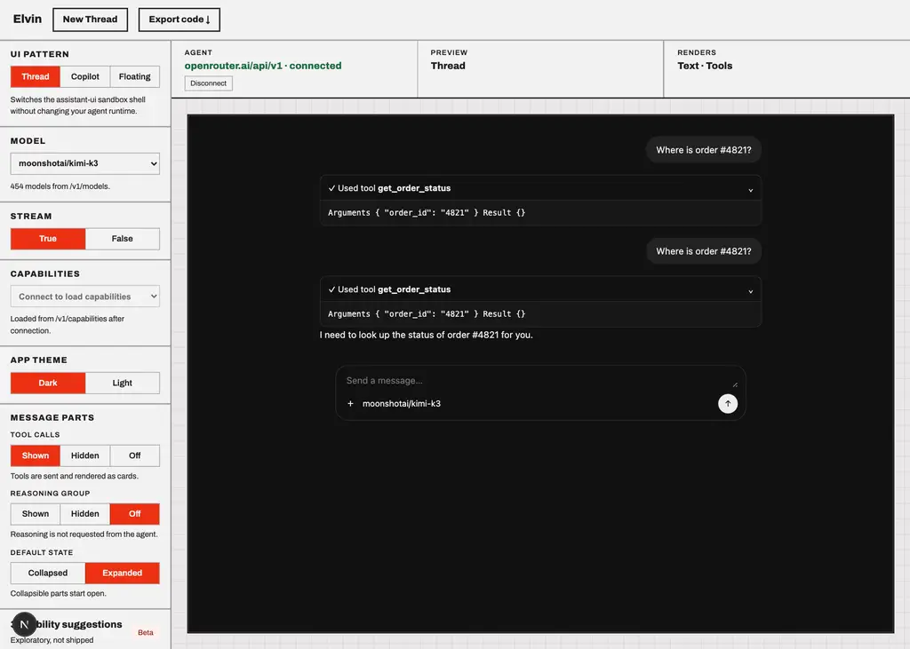
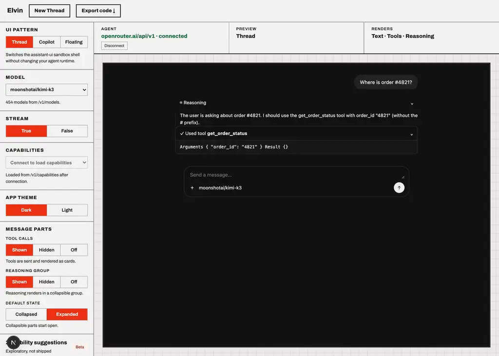

# moonshotai/kimi-k3

Probe of OpenRouter `moonshotai/kimi-k3` — reasoning and tool-calling, each toggled independently.

- Generated: 2026-09-23T09:39:16.672Z
- Endpoint: `POST https://openrouter.ai/api/v1/chat/completions` (streaming, `max_tokens: 2000`)
- Prompt: `Two things, please: (1) work out 17*23 step by step, and (2) call get_weather with city="Paris" for the current weather there. Show your working for the arithmetic.`
- Tool: `get_weather` (`type: "function"`, JSON Schema params, `tool_choice: "auto"`)

## Model metadata (from `GET /api/v1/models`)

```json
{
  "id": "moonshotai/kimi-k3",
  "name": "MoonshotAI: Kimi K3",
  "context_length": 1048576,
  "supported_parameters": [
    "frequency_penalty",
    "include_reasoning",
    "logit_bias",
    "logprobs",
    "max_tokens",
    "min_p",
    "presence_penalty",
    "reasoning",
    "reasoning_effort",
    "repetition_penalty",
    "response_format",
    "seed",
    "stop",
    "structured_outputs",
    "temperature",
    "tool_choice",
    "tools",
    "top_k",
    "top_logprobs",
    "top_p"
  ],
  "reasoning": {
    "mandatory": false,
    "default_enabled": true,
    "supported_efforts": [
      "max",
      "high",
      "low"
    ],
    "default_effort": "max"
  }
}
```

- declares `tools`: **true**
- declares `reasoning`: **true**

## Matrix

| reasoning | tools | HTTP | mode | reasoning? | kind | reasoning field | tool call? | args type | finish |
| --- | --- | --- | --- | --- | --- | --- | --- | --- | --- |
| on | on | 200 | stream | yes (1458 chars) | reasoning.text | delta.reasoning, delta.reasoning_details[].type|text|format|index | yes (get_weather) | string(JSON) | tool_calls |
| on | off | 200 | stream | yes (2922 chars) | reasoning.text | delta.reasoning, delta.reasoning_details[].type|text|format|index | no | - | stop |
| off | on | 200 | stream | no | - | - | yes (get_weather) | string(JSON) | tool_calls |
| off | off | 200 | stream | no | - | - | no | - | stop |

## Toggle behaviour

- reasoning on → produced reasoning: **true**; off → produced reasoning: **false**
- tools on → tool call: **true**; tools off → tool call: **false**

## Key inventory (streamed chunks)

```
choices
choices[]
choices[].delta
choices[].delta.content
choices[].delta.reasoning
choices[].delta.reasoning_details
choices[].delta.reasoning_details[]
choices[].delta.reasoning_details[].format
choices[].delta.reasoning_details[].index
choices[].delta.reasoning_details[].text
choices[].delta.reasoning_details[].type
choices[].delta.role
choices[].delta.tool_calls
choices[].delta.tool_calls[]
choices[].delta.tool_calls[].function
choices[].delta.tool_calls[].function.arguments
choices[].delta.tool_calls[].function.name
choices[].delta.tool_calls[].id
choices[].delta.tool_calls[].index
choices[].delta.tool_calls[].type
choices[].finish_reason
choices[].index
choices[].native_finish_reason
created
id
model
object
provider
service_tier
usage
usage.completion_tokens
usage.completion_tokens_details
usage.completion_tokens_details.audio_tokens
usage.completion_tokens_details.image_tokens
usage.completion_tokens_details.reasoning_tokens
usage.cost
usage.cost_details
usage.cost_details.upstream_inference_completions_cost
usage.cost_details.upstream_inference_cost
usage.cost_details.upstream_inference_prompt_cost
usage.is_byok
usage.prompt_tokens
usage.prompt_tokens_details
usage.prompt_tokens_details.audio_tokens
usage.prompt_tokens_details.cache_write_tokens
usage.prompt_tokens_details.cached_tokens
usage.prompt_tokens_details.video_tokens
usage.total_tokens
```

## Raw evidence

### reasoning=on tools=on

- HTTP 200 in 4717ms, content-type `text/event-stream`, 88 SSE lines
- reasoning captured:

```text
TheThe user wants two things:
 user wants two things:
1. Calculate1. Calculate 17*23 step by step
 17*23 step by step
2. Call get_weather with city2. Call get_weather with city="Paris"

For="Paris"

For the arithmetic, I can do that the arithmetic, I can do that directly directly:
:
17 *17 * 23
 23
= 17 * (20 + = 17 * (20 + 3)
= 17*3)
= 17*20 + 17*3
=20 + 17*3
= 340 + 51
=  340 + 51
= 391

Let me verify: 17391

Let me verify: 17 * 23. * 23. 17 17 * 23 = 17 * * 23 = 17 * 23. Alternative 23. Alternative: 23: 23 * 17 = 23* * 17 = 23*10 + 23*7 = 10 + 23*7 = 230 + 161 = 391.230 + 161 = 391. Yes, 391.

I Yes, 391.

I should call the get should call the get_weather function_weather function for Paris. I for Paris. I can do can do the arithmetic in the arithmetic in my response text my response te
```
- tool calls:

```json
[
  {
    "id": "get_weather:0",
    "name": "get_weather",
    "arguments": "{\"city\": \"Paris\"}",
    "argumentsType": "string(JSON)"
  }
]
```
- content:

```text
**(1) Calculating 17 × 23 step by step:**

Break 23 into 20 + 3, then distribute:
- 17 × 20 = 340
- 17 × 3 = 51
- Add them together: 340 + 51 = **391**

Check (the other way): 23 × 17 = 23 × 10 + 23 × 7 = 230 + 161 = 391 ✓

**(2) Getting the current weather in Paris:**
```
- first SSE payloads verbatim:

```text
{"id":"gen-1790156333-CIF1P2of5Ea1x0Jw1VkX","object":"chat.completion.chunk","created":1790156333,"model":"moonshotai/kimi-k3","provider":"Modal","choices":[{"index":0,"delta":{"content":"","role":"assistant","reasoning":"The","reasoning_details":[{"type":"reasoning.text","text":"The","format":"unknown","index":0}]},"finish_reason":null,"native_finish_reason":null}]}
{"id":"gen-1790156333-CIF1P2of5Ea1x0Jw1VkX","object":"chat.completion.chunk","created":1790156333,"model":"moonshotai/kimi-k3","provider":"Modal","choices":[{"index":0,"delta":{"content":"","role":"assistant","reasoning":" user wants two things:\n","reasoning_details":[{"type":"reasoning.text","text":" user wants two things:\n","format":"unknown","index":0}]},"finish_reason":null,"native_finish_reason":null}]}
{"id":"gen-1790156333-CIF1P2of5Ea1x0Jw1VkX","object":"chat.completion.chunk","created":1790156333,"model":"moonshotai/kimi-k3","provider":"Modal","choices":[{"index":0,"delta":{"content":"","role":"assistant","reasoning":"1. Calculate","reasoning_details":[{"type":"reasoning.text","text":"1. Calculate","format":"unknown","index":0}]},"finish_reason":null,"native_finish_reason":null}]}
{"id":"gen-1790156333-CIF1P2
```

### reasoning=on tools=off

- HTTP 200 in 12794ms, content-type `text/event-stream`, 181 SSE lines
- reasoning captured:

```text
TheThe user is asking for user is asking for two things:
1. Work two things:
1. Work out 17*23 step out 17*23 step by step
2. Call by step
2. Call get_weather with city=" get_weather with city="Paris"

But wait —Paris"

But wait — I don't I don't see see any any tools available in this conversation. tools available in this conversation. There's no function/tool There's no function/tool definitions provided. definitions provided. The user is The user is asking me to call `get asking me to call `get_weather`, but no such_weather`, but no such tool tool exists in my available functions exists in my available functions. There. There are no are no tools declared at tools declared at all in all in this conversation.

So I should this conversation.

So I should:
1. Do the arithmetic:
1. Do the ar
```
- content:

```text
## 1. Calculating 17 × 23

Using the distributive property, split 23 into 20 + 3:

- **Step 1:** 17 × 20 = 340
- **Step 2:** 17 × 3 = 51
- **Step 3:** 340 + 51 = **391**

Check with long multiplication:
```
   17
 × 23
 ----
   51   (17 × 3)
  340   (17 × 20)
 ----
  391
```

**Answer: 391**

## 2. Weather in Paris

I can't complete this one — I don't have a `get_weather` tool (or any other tools)
```
- first SSE payloads verbatim:

```text
{"id":"gen-1790156338-3f2q09Sulmiadp60Rsp9","object":"chat.completion.chunk","created":1790156338,"model":"moonshotai/kimi-k3","provider":"InferenceNet","choices":[{"index":0,"delta":{"content":"","role":"assistant","reasoning":"The","reasoning_details":[{"type":"reasoning.text","text":"The","format":"unknown","index":0}]},"finish_reason":null,"native_finish_reason":null}]}
{"id":"gen-1790156338-3f2q09Sulmiadp60Rsp9","object":"chat.completion.chunk","created":1790156338,"model":"moonshotai/kimi-k3","provider":"InferenceNet","choices":[{"index":0,"delta":{"content":"","role":"assistant","reasoning":" user is asking for","reasoning_details":[{"type":"reasoning.text","text":" user is asking for","format":"unknown","index":0}]},"finish_reason":null,"native_finish_reason":null}]}
{"id":"gen-1790156338-3f2q09Sulmiadp60Rsp9","object":"chat.completion.chunk","created":1790156338,"model":"moonshotai/kimi-k3","provider":"InferenceNet","choices":[{"index":0,"delta":{"content":"","role":"assistant","reasoning":" two things:\n1. Work","reasoning_details":[{"type":"reasoning.text","text":" two things:\n1. Work","format":"unknown","index":0}]},"finish_reason":null,"native_finish_reason":null}]}
{
```

### reasoning=off tools=on

- HTTP 200 in 2913ms, content-type `text/event-stream`, 44 SSE lines
- tool calls:

```json
[
  {
    "id": "get_weather:0",
    "name": "get_weather",
    "arguments": "{\"city\": \"Paris\"}",
    "argumentsType": "string(JSON)"
  }
]
```
- content:

```text
Here is the step-by-step for the arithmetic, and the weather tool is being called now.

**Arithmetic: 17 × 23**
1. Multiply 17 by the ones digit (3): `17 × 3 = 51`
2. Multiply 17 by the tens digit (20): `17 × 20 = 340`
3. Add them together: `51 + 340 = 391`

So, **17 × 23 = 391**.

I will now call the weather tool for Paris.
```
- first SSE payloads verbatim:

```text
{"id":"gen-1790156350-I44UDTGE0oWJmnFaQEy7","object":"chat.completion.chunk","created":1790156350,"model":"moonshotai/kimi-k3","provider":"Sail Research","choices":[{"index":0,"delta":{"content":"Here","role":"assistant"},"finish_reason":null,"native_finish_reason":null}]}
{"id":"gen-1790156350-I44UDTGE0oWJmnFaQEy7","object":"chat.completion.chunk","created":1790156350,"model":"moonshotai/kimi-k3","provider":"Sail Research","choices":[{"index":0,"delta":{"content":" is","role":"assistant"},"finish_reason":null,"native_finish_reason":null}]}
{"id":"gen-1790156350-I44UDTGE0oWJmnFaQEy7","object":"chat.completion.chunk","created":1790156350,"model":"moonshotai/kimi-k3","provider":"Sail Research","choices":[{"index":0,"delta":{"content":" the","role":"assistant"},"finish_reason":null,"native_finish_reason":null}]}
{"id":"gen-1790156350-I44UDTGE0oWJmnFaQEy7","object":"chat.completion.chunk","created":1790156350,"model":"moonshotai/kimi-k3","provider":"Sail Research","choices":[{"index":0,"delta":{"content":" step-by-step for","role":"assistant"},"finish_reason":null,"native_finish_reason":null}]}
{"id":"gen-1790156350-I44UDTGE0oWJmnFaQEy7","object":"chat.completion.chunk","created":17901
```

### reasoning=off tools=off

- HTTP 200 in 3002ms, content-type `text/event-stream`, 25 SSE lines
- content:

```text
I'll handle both parts for you.

**Part 1: 17 × 23**

Break it into place values:

- 17 × 23 = 17 × (20 + 3)
- 17 × 20 = 340
- 17 × 3 = 51
- Add them: 340 + 51 = **391**

So 17 × 23 = **391**.

**Part 2: Weather in Paris**
```
- first SSE payloads verbatim:

```text
{"id":"gen-1790156353-eRo4DqHHJYZzA7KYFZlB","object":"chat.completion.chunk","created":1790156353,"model":"moonshotai/kimi-k3","provider":"InferenceNet","choices":[{"index":0,"delta":{"content":"I'll","role":"assistant"},"finish_reason":null,"native_finish_reason":null}]}
{"id":"gen-1790156353-eRo4DqHHJYZzA7KYFZlB","object":"chat.completion.chunk","created":1790156353,"model":"moonshotai/kimi-k3","provider":"InferenceNet","choices":[{"index":0,"delta":{"content":" handle","role":"assistant"},"finish_reason":null,"native_finish_reason":null}]}
{"id":"gen-1790156353-eRo4DqHHJYZzA7KYFZlB","object":"chat.completion.chunk","created":1790156353,"model":"moonshotai/kimi-k3","provider":"InferenceNet","choices":[{"index":0,"delta":{"content":" both parts for","role":"assistant"},"finish_reason":null,"native_finish_reason":null}]}
{"id":"gen-1790156353-eRo4DqHHJYZzA7KYFZlB","object":"chat.completion.chunk","created":1790156353,"model":"moonshotai/kimi-k3","provider":"InferenceNet","choices":[{"index":0,"delta":{"content":" you.\n\n**Part 1","role":"assistant"},"finish_reason":null,"native_finish_reason":null}]}
{"id":"gen-1790156353-eRo4DqHHJYZzA7KYFZlB","object":"chat.completion.chunk","cre
```

## Screenshots (Elvin testbed against this model)



