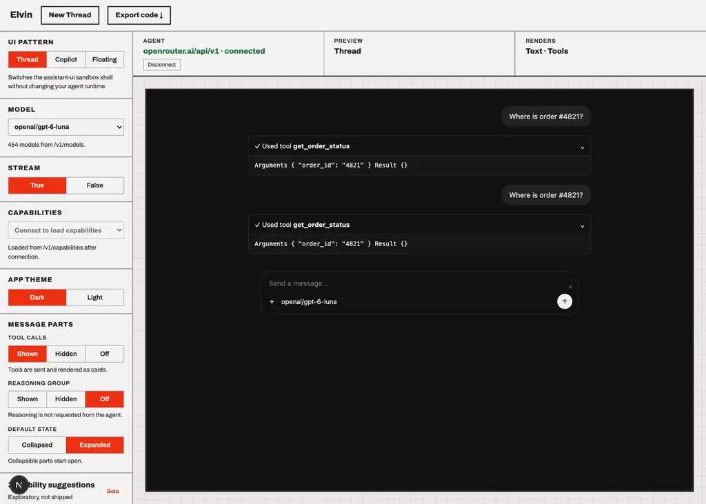
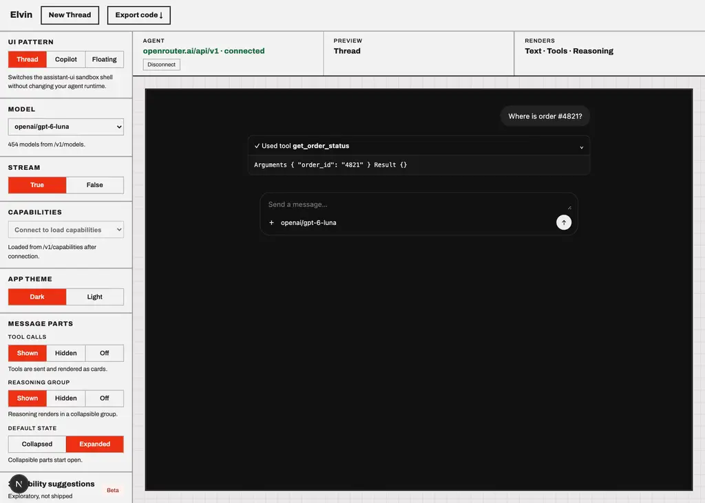

# openai/gpt-6-luna

Probe of OpenRouter `openai/gpt-6-luna` — reasoning and tool-calling, each toggled independently.

- Generated: 2026-09-23T09:37:51.392Z
- Endpoint: `POST https://openrouter.ai/api/v1/chat/completions` (streaming, `max_tokens: 2000`)
- Prompt: `Two things, please: (1) work out 17*23 step by step, and (2) call get_weather with city="Paris" for the current weather there. Show your working for the arithmetic.`
- Tool: `get_weather` (`type: "function"`, JSON Schema params, `tool_choice: "auto"`)

## Model metadata (from `GET /api/v1/models`)

```json
{
  "id": "openai/gpt-6-luna",
  "name": "OpenAI: GPT-6 Luna",
  "context_length": 1050000,
  "supported_parameters": [
    "include_reasoning",
    "max_completion_tokens",
    "max_tokens",
    "reasoning",
    "reasoning_effort",
    "response_format",
    "seed",
    "structured_outputs",
    "tool_choice",
    "tools"
  ],
  "reasoning": {
    "mandatory": false,
    "default_enabled": true,
    "supported_efforts": [
      "max",
      "xhigh",
      "high",
      "medium",
      "low",
      "none"
    ],
    "default_effort": "medium"
  }
}
```

- declares `tools`: **true**
- declares `reasoning`: **true**

## Matrix

| reasoning | tools | HTTP | mode | reasoning? | kind | reasoning field | tool call? | args type | finish |
| --- | --- | --- | --- | --- | --- | --- | --- | --- | --- |
| on | on | 200 | stream | no | - | - | yes (get_weather) | string(JSON) | tool_calls |
| on | off | 200 | stream | no | reasoning.encrypted | delta.reasoning_details[].type|data|format|id|index | no | - | stop |
| off | on | 200 | stream | no | - | - | yes (get_weather) | string(JSON) | tool_calls |
| off | off | 200 | stream | no | - | - | no | - | stop |

## Toggle behaviour

- reasoning on → produced reasoning: **false**; off → produced reasoning: **false**
- tools on → tool call: **true**; tools off → tool call: **false**

## Key inventory (streamed chunks)

```
choices
choices[]
choices[].delta
choices[].delta.content
choices[].delta.reasoning
choices[].delta.reasoning_details
choices[].delta.reasoning_details[]
choices[].delta.reasoning_details[].data
choices[].delta.reasoning_details[].format
choices[].delta.reasoning_details[].id
choices[].delta.reasoning_details[].index
choices[].delta.reasoning_details[].type
choices[].delta.role
choices[].delta.tool_calls
choices[].delta.tool_calls[]
choices[].delta.tool_calls[].function
choices[].delta.tool_calls[].function.arguments
choices[].delta.tool_calls[].function.name
choices[].delta.tool_calls[].id
choices[].delta.tool_calls[].index
choices[].delta.tool_calls[].type
choices[].finish_reason
choices[].index
choices[].native_finish_reason
created
id
model
object
provider
service_tier
usage
usage.completion_tokens
usage.completion_tokens_details
usage.completion_tokens_details.audio_tokens
usage.completion_tokens_details.image_tokens
usage.completion_tokens_details.reasoning_tokens
usage.cost
usage.cost_details
usage.cost_details.upstream_inference_completions_cost
usage.cost_details.upstream_inference_cost
usage.cost_details.upstream_inference_prompt_cost
usage.is_byok
usage.prompt_tokens
usage.prompt_tokens_details
usage.prompt_tokens_details.audio_tokens
usage.prompt_tokens_details.cache_write_tokens
usage.prompt_tokens_details.cached_tokens
usage.prompt_tokens_details.video_tokens
usage.total_tokens
```

## Raw evidence

### reasoning=on tools=on

- HTTP 200 in 1507ms, content-type `text/event-stream`, 10 SSE lines
- tool calls:

```json
[
  {
    "id": "call_IvK90xIiFCHyzAQzfuIm8gsU",
    "name": "get_weather",
    "arguments": "{\"city\":\"Paris\"}",
    "argumentsType": "string(JSON)"
  }
]
```
- first SSE payloads verbatim:

```text
{"id":"gen-1790156262-ZjRfm5CAqu3DSU1poh4i","object":"chat.completion.chunk","created":1790156262,"model":"openai/gpt-6-luna","provider":"OpenAI","choices":[{"index":0,"delta":{"content":null,"role":"assistant","tool_calls":[{"index":0,"id":"call_IvK90xIiFCHyzAQzfuIm8gsU","type":"function","function":{"name":"get_weather","arguments":""}}]},"finish_reason":null,"native_finish_reason":null}]}
{"id":"gen-1790156262-ZjRfm5CAqu3DSU1poh4i","object":"chat.completion.chunk","created":1790156262,"model":"openai/gpt-6-luna","provider":"OpenAI","choices":[{"index":0,"delta":{"content":null,"role":"assistant","tool_calls":[{"index":0,"function":{"arguments":""}}]},"finish_reason":null,"native_finish_reason":null}]}
{"id":"gen-1790156262-ZjRfm5CAqu3DSU1poh4i","object":"chat.completion.chunk","created":1790156262,"model":"openai/gpt-6-luna","provider":"OpenAI","choices":[{"index":0,"delta":{"content":null,"role":"assistant","tool_calls":[{"index":0,"function":{"arguments":"{\""}}]},"finish_reason":null,"native_finish_reason":null}]}
{"id":"gen-1790156262-ZjRfm5CAqu3DSU1poh4i","object":"chat.completion.chunk","created":1790156262,"model":"openai/gpt-6-luna","provider":"OpenAI","choices":[{"index
```

### reasoning=on tools=off

- HTTP 200 in 2634ms, content-type `text/event-stream`, 72 SSE lines
- content:

```text
\(17 \times 23 = 17 \times (20 + 3) = (17 \times 20) + (17 \times 3) = 340 + 51 = \boxed{391}\).

I can’t call `get_weather` from this chat, so I can’t provide current weather for Paris.
```
- first SSE payloads verbatim:

```text
{"id":"gen-1790156264-8sZc5JQai7xDOUXxKj4y","object":"chat.completion.chunk","created":1790156264,"model":"openai/gpt-6-luna","provider":"OpenAI","choices":[{"index":0,"delta":{"content":"","role":"assistant","reasoning":null,"reasoning_details":[{"type":"reasoning.encrypted","data":"gAAAAABqs53qZCG4G16PIVUyjAw4uhCvLhzY3YLbLv6XB_b1q5bxSwua8XF8q6cGEnR3AWNPXraKIWvLg7BmUItQA-ocPFNz_uD6XxM-PcgBgecRe9HvR0BJtF0MzlotH6xg_aPeznw1b1iH20SUEh_OZNT11rsWDiuoXnR1uZyQmlW83iEwI2qdIwkM39HnzauVJmprxU-hHmLmZuEMNlXI4O_WlDSWLwF1J7TR72nM0eOkAFiBqvl8KRvPw3zaiP3NPa1r1oFCjENgqtOZ7e7eYbcxLpedcDtQ5BJefapSYDjlVPj1Dfa-n4DK9GcdRMXknw00aRlIBCqLLUUjAo_Nrx38LSk50x8wQg17QlBuynnID_oIGtHw41LRbkLj3ud2r0Rg5f5eb3fuGOY7y3NPN4cYq6cCCUW9rD55FBhXiyRUVVzePEsLvG_gV1BIl6wO6MW7c2m7wi_iFjLl_9OhPxqGlOWp3O0NsX2VnYGZmRsdwAUEuXWyYNxxXI43YcxY1jFiRXbM_886VKf8xEqGfMptC2puau3ZTPXM481ma-f4V8AKSpeCAEve9IAdc0TphcY-dnjD6rSQdbKRuXpRDH8jGoqdXXREjwf5Id7DML2usUQqGc0PN86yEfkPbzTrebzYxDYLXHFq1uti0g12895E-QX04BVs0B26M1L8DA8_HoqrPvby7CLYU5J0iOHV0v31ipVh6bqC_Pp_NUhZvPBgJJwnRZacKQbn9nM-DhZaWjDadt-Rds0OFrydy49PEoIQKIn3JXLl1tLEzcEjIq9JTuRJXPQHm7ao2yob85ekuH4zfbf54tOSAU2aUOrwDv57MGFMJbFlpSVrm696gba5DLekxvpHZzeVBckVg5i_NDCTWv6YO6z1jHzBZac-Xl_h7Lx_lEMhM2y
```

### reasoning=off tools=on

- HTTP 200 in 1551ms, content-type `text/event-stream`, 10 SSE lines
- tool calls:

```json
[
  {
    "id": "call_lWL6lVkyrp15bMr231uzkuQ8",
    "name": "get_weather",
    "arguments": "{\"city\":\"Paris\"}",
    "argumentsType": "string(JSON)"
  }
]
```
- first SSE payloads verbatim:

```text
{"id":"gen-1790156267-zaYy1wT7JRq5iVVETf7k","object":"chat.completion.chunk","created":1790156267,"model":"openai/gpt-6-luna","provider":"OpenAI","choices":[{"index":0,"delta":{"content":null,"role":"assistant","tool_calls":[{"index":0,"id":"call_lWL6lVkyrp15bMr231uzkuQ8","type":"function","function":{"name":"get_weather","arguments":""}}]},"finish_reason":null,"native_finish_reason":null}]}
{"id":"gen-1790156267-zaYy1wT7JRq5iVVETf7k","object":"chat.completion.chunk","created":1790156267,"model":"openai/gpt-6-luna","provider":"OpenAI","choices":[{"index":0,"delta":{"content":null,"role":"assistant","tool_calls":[{"index":0,"function":{"arguments":""}}]},"finish_reason":null,"native_finish_reason":null}]}
{"id":"gen-1790156267-zaYy1wT7JRq5iVVETf7k","object":"chat.completion.chunk","created":1790156267,"model":"openai/gpt-6-luna","provider":"OpenAI","choices":[{"index":0,"delta":{"content":null,"role":"assistant","tool_calls":[{"index":0,"function":{"arguments":"{\""}}]},"finish_reason":null,"native_finish_reason":null}]}
{"id":"gen-1790156267-zaYy1wT7JRq5iVVETf7k","object":"chat.completion.chunk","created":1790156267,"model":"openai/gpt-6-luna","provider":"OpenAI","choices":[{"index
```

### reasoning=off tools=off

- HTTP 200 in 2782ms, content-type `text/event-stream`, 99 SSE lines
- content:

```text
I’ll calculate the product step by step, and check the current weather in Paris.

\(17 \times 23 = 17 \times (20 + 3)\)

- \(17 \times 20 = 340\)
- \(17 \times 3 = 51\)
- \(340 + 51 = \boxed{391}\)

I can’t access a `get_weather` tool in this chat, so I can’t retrieve Paris’s current weather.
```
- first SSE payloads verbatim:

```text
{"id":"gen-1790156268-TCfuDsKZQY6uPb2Rm6zw","object":"chat.completion.chunk","created":1790156268,"model":"openai/gpt-6-luna","provider":"OpenAI","choices":[{"index":0,"delta":{"content":"I","role":"assistant"},"finish_reason":null,"native_finish_reason":null}]}
{"id":"gen-1790156268-TCfuDsKZQY6uPb2Rm6zw","object":"chat.completion.chunk","created":1790156268,"model":"openai/gpt-6-luna","provider":"OpenAI","choices":[{"index":0,"delta":{"content":"’ll","role":"assistant"},"finish_reason":null,"native_finish_reason":null}]}
{"id":"gen-1790156268-TCfuDsKZQY6uPb2Rm6zw","object":"chat.completion.chunk","created":1790156268,"model":"openai/gpt-6-luna","provider":"OpenAI","choices":[{"index":0,"delta":{"content":" calculate","role":"assistant"},"finish_reason":null,"native_finish_reason":null}]}
{"id":"gen-1790156268-TCfuDsKZQY6uPb2Rm6zw","object":"chat.completion.chunk","created":1790156268,"model":"openai/gpt-6-luna","provider":"OpenAI","choices":[{"index":0,"delta":{"content":" the","role":"assistant"},"finish_reason":null,"native_finish_reason":null}]}
{"id":"gen-1790156268-TCfuDsKZQY6uPb2Rm6zw","object":"chat.completion.chunk","created":1790156268,"model":"openai/gpt-6-luna","provide
```

## Screenshots (Elvin testbed against this model)



